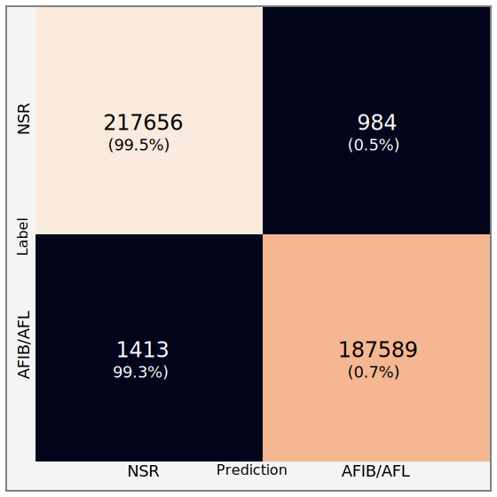

# ♥️ Heart Kit

We leverage the latest AI techniques paired with Ambiq's ultra low-power microcontrollers to enable running a variety of real-time, wearable heart monitoring tasks.

## Tasks

### Heart Rate & Rhythm

From ECG segmentations, extract heart rate as well as rhythm (sinus, bradycardia, tachycardia).

### Heart Rate Variability

Compute advanced heart rate variability (HRV) metrics.

### Heart Arrhythmia Detection

Identify heart arrhythmias using single lead ECG. Classification can be performed on either rhythm (e.g. NSR, AFIB, AFL) or beat (e.g. PAC, PVC). The current arrhythmia model is able to perform rhythm-level classification with over 99% accuracy. Longer term goal is to perform beat-level classification.

### Cardio Fitness / respiration

## Prerequisite

* [Python 3.9+](https://www.python.org)
* [Poetry 1.2.1+](https://python-poetry.org/docs/#installation)

The following are also required to compile/flash the binary for the EVB demo:

* [Arm GNU Toolchain 11.3](https://developer.arm.com/downloads/-/arm-gnu-toolchain-downloads)
* [Segger J-Link v7.56+](https://www.segger.com/downloads/jlink/)

## Usage

`HeartKit` is intended to be used as either a CLI-based app or as a python package to perform additional tasks and experiments. To get started, first install the local python package `heartkit` along with its dependencies via `Poetry`:

```bash
poetry install
```

### CLI Application

The CLI provides a number of commands discussed below. In general, reference configurations are provided to download datasets, train/evaluate/export models, and lastly demo models on Apollo 4 EVB. Pre-trained reference models are also included to enable running inference and the demo immediately.

> NOTE: Before running commands, be sure to activate python environment: `poetry shell`. On Windows using Powershell, use `.venv\Scripts\activate.ps1`.

#### 1. Download Datasets (download)

The `download` command is used to download all datasets specified in the configuration file. Please refer to [Datasets section](#datasets) for details on the available datasets. The following command will download and prepare all currently used datasets.


```bash
heartkit download --config-file ./configs/download-datasets.json
```

> NOTE: The __Icentia11k dataset__ requires roughly 200 GB of disk space and can take around 2 hours to download.


#### 2. Train Model

The `train` command is used to train a heart kit model. The following command will train the arrhythmia model using the reference configuration. Please refer to `configs/train-rhythm-model.json` and `heartkit/types.py` to see supported options.

```bash
heartkit train --config-file ./configs/train-arrhythmia-model.json
```

> Due to the large dataset and class imbalance, the batch size and buffer size are large to ensure properly shuffling of patients as well as classes. The first epoch will take much longer as it fills up this shuffled buffer. To train on a dedicated GPU, it's recommended to have at least 10 GB of VRAM.

#### 3. Evaluate Model

The `evaluate` command will evaluate the performance of the model on the reserved test set. A confidence threshold can also be set such that a label is only assigned when the model's probability is greater than the threshold; otherwise, a label of inconclusive will be assigned.

```bash
heartkit evaluate --config-file ./configs/test-arrhythmia-model.json
```

#### 4. Export Model

The `export` command will convert the trained TensorFlow model into both TFLite (TFL) and TFLite for microcontroller (TFLM) variants. The command will also verify the models' outputs match. Post-training quantization can also be enabled by setting the `quantization` flag in the configuration.

```bash
heartkit export --config-file ./configs/export-arrhythmia-model.json
```

Once converted, the TFLM header file will be copied to `./evb/src/model_buffer.h`. If parameters were changed (e.g. window size, quantization), `./evb/src/constants.h` will need to be updated.

#### 5. EVB Demo

The `demo` command is used to run the model on an Apollo 4 evaluation board (EVB). This setup requires both a host PC along with an Apollo 4 EVB. The host PC acts as a server and provides test samples to the EVB. The host PC is also used to provide status updates and model results from the EVB. The EVB runs in client mode- its job is to fetch samples and perform real-time inference using the arrhythmia model. Please refer to [EVB Demo Setup](./docs/evb_demo.md) for additional details.

```bash
heartkit demo --config-file ./configs/evb-arrhythmia-demo.json
```

## Architecture

The current network is based on a 1-D CNN architecture. The CNN is based on ResNet but adapted for 1-D input and utilizes longer filter sizes. The network as input takes windows (5 seconds) of raw ECG data. The only preprocessing performed is band-pass filtering and standardization on the window of ECG data.

## Datasets

A number of datasets are readily available online that are suitable for training various heart-related models. The following datasets are ones we use or plan to use. For _arrhythmia_, we are only using [Icentia11k](#icentia11k-dataset) dataset as it contains the largest number of patients in a highly ambulatory setting- users wearing a 1-lead chest band for up to two weeks. Please make sure to review each dataset's license for terms and limitations.

### Icentia11k Dataset

This dataset consists of ECG recordings from 11,000 patients and 2 billion labelled beats. The data was collected by the CardioSTAT, a single-lead heart monitor device from Icentia. The raw signals were recorded with a 16-bit resolution and sampled at 250 Hz with the CardioSTAT in a modified lead 1 position. We provide derived version of the dataset where each patient is stored in separate [HDF5 files](https://www.hdfgroup.org/solutions/hdf5/) on S3. This makes it faster to download as well as makes it possible to leverage TensorFlow `prefetch` and `interleave` to parallelize loading data.

__Heart Tasks__: Arrhythmia

> NOTE: The dataset is intended for evaluation purposes only and cannot be used for commercial use without permission. Please visit [Physionet](https://physionet.org/content/icentia11k-continuous-ecg/1.0/) for more details.

### LUDB (Lobachevsky University Electrocardiography Database)

ECG signal database that consists of 200 10-second 12-lead records. The boundaries and peaks of P, T waves and QRS complexes were manually annotated by cardiologists. Each record is annotated with the corresponding diagnosis. Please visit [Physionet](https://physionet.org/content/ludb/1.0.1/) for more details.

__Heart Tasks__: Segmentation, HRV

### QT Database:

Over 100 fifteen-minute two-lead ECG recordings with onset, peak, and end markers for P, QRS, T, and (where present) U waves of from 30 to 50 selected beats in each recording. Please visit [Physionet](https://physionet.org/content/qtdb/1.0.0/) for more details.

__Heart Tasks__: Segmentation, HRV

### MIT BIH Arrhythmia Dataset

This dataset consists of ECG recordings from 47 different subjects recorded at a sampling rate of 360 Hz. 23 records (numbered from 100 to 124 inclusive with some numbers missing) chosen at random from this set, and 25 records (numbered from 200 to 234 inclusive, again with some numbers missing) selected from the same set to include a variety of rare but clinically important phenomena that would not be well-represented by a small random sample of Holter recordings. Each of the 48 records is slightly over 30 minutes long. Please visit [Physionet](https://physionet.org/content/mitdb/1.0.0/) for more details.

__Heart Tasks__: Arrhythmia

### MIT BIH Normal Sinus Rhythm Dataset:

This dataset includes 18 long-term ECG recordings of subjects referred to the Arrhythmia Laboratory at Boston's Beth Israel Hospital (now the Beth Israel Deaconess Medical Center). Subjects included in this dataset were found to have had no significant arrhythmias; they include 5 men, aged 26 to 45, and 13 women, aged 20 to 50. Please visit [Physionet](https://physionet.org/content/nsrdb/1.0.0/) for more details.

__Heart Tasks__: HRV

### PTB Diagnostics Dataset:
This dataset consists of ECG records from 290 subjects: 148 diagnosed as MI, 52 healthy control, and the rest are diagnosed with 7 different disease. Each record contains ECG signals from 12 leads sampled at the frequency of 1000 Hz. Please visit [Physionet](https://physionet.org/content/ptbdb/1.0.0/) for more details.

## Results

### Heart Arrhythmia

The results of the arrhythmia model when testing on 1,000 patients (not used during training) is summarized below. The baseline model is simply selecting the argmax of model ouputs (`normal`, `AFIB`). The 95% confidence version adds inconclusive label that is assigned when softmax output is less than 95% for any model output.

| Metric   | Baseline | 95% Confidence |
| -------- | -------- | -------------- |
| Accuracy | 96.17%   | 99.41%         |
| F1 Score | 96.17%   | 99.41%         |



## Reference Papers

* [ECG Heartbeat classification using deep transfer learning with Convolutional Neural Network and STFT technique](https://arxiv.org/abs/2206.14200)
* [Classification of ECG based on Hybrid Features using CNNs for Wearable Applications](https://arxiv.org/pdf/2206.07648.pdf)
* [ECG Heartbeat classification using deep transfer learning with Convolutional Neural Network and STFT technique](https://arxiv.org/pdf/2206.14200.pdf)

## Future Milestones

* [x] Create end-to-end EVB demo
* [x] Perform model quantization
* [x] Perform power optimization
* [x] Add Atrial Flutter (AFL) to arrhythmia model
* [ ] Develop core network to perform ECG segmentation
* [ ] Perform beat-level classification
* [ ] Fine-tune on another dataset
* [ ] Use PPG based dataset
