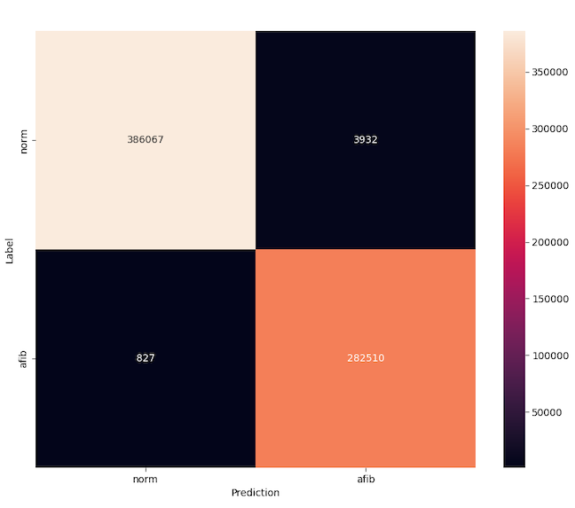

# ♥️ Heart Arrhythmia Classification

The objective is to perform real-time heart arrhythmia classification using 1-lead ECG and optionally PPG. Classification can be performed on either rhythm (e.g. normal, AFIB, AFL) or beat (e.g. PAC, PVC). The current model is able to perform AFIB arrhythmia classification with over 99% accuracy. In the near future, this will be extended to include Atrial flutter. Longer term goal is to perform beat-level classification.

## Prerequisite

* [Python 3.9+](https://www.python.org)
* [Poetry 1.2.1+](https://python-poetry.org/docs/#installation)

The following are also required to compile the binary for the EVB demo:

* [Arm GNU Toolchain 11.3](https://developer.arm.com/downloads/-/arm-gnu-toolchain-downloads)
* [Segger J-Link v7.56+](https://www.segger.com/downloads/jlink/)

## Usage

To get started, first install the local python package `ecgarr` along with its dependencies via `Poetry`:

```bash
poetry install
```

The python package is intended to be used as a CLI-based app and provides a number of commands discussed below. In general, reference configurations are provided to (1) download the dataset, (2) train the model, (3) test the model, (4) deploy the model, and (5) run demo on Apollo 4 EVB hardware. Pre-trained reference models are also included to enable running inference and the demo immediately.

> NOTE: Before running commands, be sure to activate python environment: `poetry shell`

### 1. Download Dataset (download_dataset)

The `download_dataset` command will download the entire [Icentia11k dataset](https://physionet.org/content/icentia11k-continuous-ecg/1.0/) as a single zip file as well as convert into individual patient [HDF5 files](https://www.hdfgroup.org/solutions/hdf5/) (e.g. `p00001.h5`). The latter makes it possible to leverage TensorFlow `prefetch` and `interleave` to parallelize loading data.

```bash
python -m ecgarr download_dataset --config-file ./configs/download-dataset.json
```

> NOTE: The dataset requires roughly 300 GB of disk space and can take around 6 hours to download. Once the command finishes, the zip file (`./datasets/icentia11k/icentia11k.zip`) can be deleted to free up 188 GB.

### 2. Train Model (train_model)

The `train_model` command is used to train the arrhythmia model. The following command will train the model using the reference configuration. Please refer to `configs/train-model.json` and `ecgarr/types.py` to see supported options.

```bash
python -m ecgarr train_model --config-file ./configs/train-model.json
```

> Due to the large dataset and class imbalance, the batch size and buffer size are large to ensure properly shuffling of patients as well as classes. The first epoch will take much longer as it fills up this shuffled buffer. To train on a dedicated GPU, it's recommended to have at least 10 GB of VRAM.

### 3. Test Model (test_model)

The `test_model` command will evaluate the performance of the model on the reserved test set. A confidence threshold can also be set such that a label is only assigned when the model's probability is greater than the threshold; otherwise, a label of inconclusive will be assigned. Using a threshold of 95% will lead to roughly 15% of test data being labeled as inconclusive while increasing F1 score from __95.3%__ to __99.3%__ and accuracy from __96.4%__ to __99.3%__.

```bash
python -m ecgarr test_model --config-file ./configs/test-model.json
```

### 4. Deploy Model (deploy_model)

The `deploy_model` command will convert the trained TensorFlow model into both TFLite (TFL) and TFLite for microcontroller (TFLM) variants. The command will also verify the models' outputs match. Post-training quantization can also be enabled by setting the `quantization` flag in the configuration.

```bash
python -m ecgarr deploy_model --config-file ./configs/deploy-model.json
```

Once converted, the TFLM header file will be copied to `./evb/src/model_buffer.h`. If parameters were changed (e.g. window size, quantization), `./evb/src/constants.h` will need to be updated.

### 5. EVB Demo (evb_demo)

The `evb_demo` command is used to run the model on an Apollo 4 evaluation board (EVB). This setup requires both a host PC along with an Apollo 4 EVB. The host PC acts as a server and provides test samples to the EVB. The host PC is also used to provide status updates and model results from the EVB. The EVB runs in client mode- its job is to fetch samples and perform real-time inference using the arrhythmia model. Please refer to [EVB Demo Setup](./docs/evb_demo.md) for additional details.

```bash
python -m ecgarr evb_demo --config-file ./configs/evb-demo.json
```

## Architecture

The current network is based on a 1-D CNN architecture. The CNN is based on ResNet but adapted for 1-D input and utilizes longer filter sizes. The network as input takes windows (5 seconds) of raw ECG data. The only preprocessing performed is band-pass filtering and standardization on the window of ECG data.

## Datasets

A number of datasets are readily available online that are suitable for training heart arrhythmia models. The following datasets are ones we plan to explore. Currently, we are only using `Icentia11k` dataset as it contains the largest number of patients in a highly ambulatory setting- users wearing a 1-lead chest band for up to two weeks. In future work, we intend to demonstrate fine-tuning the reference model on a different dataset (w/ different sensors, patient demographics, etc.).

* __Icentia11k Dataset__: This dataset consists of ECG recordings from 11,000 patients and 2 billion labelled beats. The data was collected by the CardioSTAT, a single-lead heart monitor device from Icentia. The raw signals were recorded with a 16-bit resolution and sampled at 250 Hz with the CardioSTAT in a modified lead 1 position. Please visit [Physionet](https://physionet.org/content/icentia11k-continuous-ecg/1.0/) for more details.

* __MIT-BIH Arrhythmia Dataset__: This dataset consists of ECG recordings from 47 different subjects recorded at a sampling rate of 360 Hz. 23 records (numbered from 100 to 124 inclusive with some numbers missing) chosen at random from this set, and 25 records (numbered from 200 to 234 inclusive, again with some numbers missing) selected from the same set to include a variety of rare but clinically important phenomena that would not be well-represented by a small random sample of Holter recordings. Each of the 48 records is slightly over 30 minutes long. Please visit [Physionet](https://physionet.org/content/mitdb/1.0.0/) for more details.

* __MIT-BIH Normal Sinus Rhythm Dataset__: This dataset includes 18 long-term ECG recordings of subjects referred to the Arrhythmia Laboratory at Boston's Beth Israel Hospital (now the Beth Israel Deaconess Medical Center). Subjects included in this dataset were found to have had no significant arrhythmias; they include 5 men, aged 26 to 45, and 13 women, aged 20 to 50. Please visit [Physionet](https://physionet.org/content/nsrdb/1.0.0/) for more details.

* __PTB Diagnostics Dataset__: This dataset consists of ECG records from 290 subjects: 148 diagnosed as MI, 52 healthy control, and the rest are diagnosed with 7 different disease. Each record contains ECG signals from 12 leads sampled at the frequency of 1000 Hz. Please visit [Physionet](https://physionet.org/content/ptbdb/1.0.0/) for more details.

## Results

The results of the AFIB model when testing on 1,000 patients (not used during training) is summarized below. The baseline model is simply selecting the argmax of model ouputs (`normal`, `AFIB`). The 95% confidence version adds inconclusive label that is assigned when softmax output is less than 95% for any model output.

| Metric   | Baseline | 95% Confidence |
| -------- | -------- | -------------- |
| Accuracy | 96.1%    | 99.3%          |
| F1 Score | 96.1%    | 99.3%          |



## Reference Papers

* [ECG Heartbeat classification using deep transfer learning with Convolutional Neural Network and STFT technique](https://arxiv.org/abs/2206.14200)
* [Classification of ECG based on Hybrid Features using CNNs for Wearable Applications](https://arxiv.org/pdf/2206.07648.pdf)
* [ECG Heartbeat classification using deep transfer learning with Convolutional Neural Network and STFT technique](https://arxiv.org/pdf/2206.14200.pdf)

## Future Milestones

* [x] Create end-to-end EVB demo
* [x] Perform model quantization
* [ ] Perform pre-processing in fixed-point
* [ ] Add Atrial Flutter (AFL) to model
* [ ] Fine-tune on another dataset
