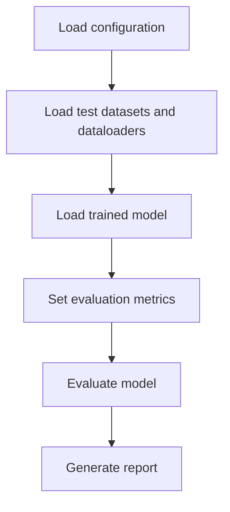

import ConfigExample from "../../../components/ConfigExample.astro";

## Introduction

Evaluate mode is used to test the performance of the model on the reserved test set for the specified task. Similar to training, the routine can be customized via CLI configuration file or by setting the parameters directly in the code. The evaluation process involves testing the model's performance on the test data to measure its accuracy, precision, recall, and F1 score. A number of results and metrics will be generated and saved to the `job_dir`.

<div class="annotate">

1. Load the configuration data (e.g. `configuration.json`)
1. Load the desired datasets (e.g. `PtbxlDataset`)
1. Load the corresponding task dataloaders (e.g. `PtbxlDataLoader`)
1. Load the trained model (e.g. `model.keras`)
1. Define the metrics (e.g. `accuracy`)
1. Evaluate the model (e.g. `model.evaluate`)
1. Generate evaluation report (e.g. `report.json`)

</div>

**Example configuration**
<ConfigExample code={"{\n    \"name\": \"arr-2-eff-sm\",\n    \"project\": \"hk-rhythm-2\",\n    \"job_dir\": \"./results/arr-2-eff-sm\",\n    \"verbose\": 2,\n    \"datasets\": [\n        {\n            \"name\": \"ptbxl\",\n            \"params\": {\n                \"path\": \"./datasets/ptbxl\"\n            }\n        }\n    ],\n    \"num_classes\": 2,\n    \"class_map\": {\n        \"0\": 0,\n        \"7\": 1,\n        \"8\": 1\n    },\n    \"class_names\": [\n        \"NORMAL\",\n        \"AFIB/AFL\"\n    ],\n    \"class_weights\": \"balanced\",\n    \"sampling_rate\": 100,\n    \"frame_size\": 512,\n    \"samples_per_patient\": [\n        10,\n        10\n    ],\n    \"val_samples_per_patient\": [\n        5,\n        5\n    ],\n    \"test_samples_per_patient\": [\n        5,\n        5\n    ],\n    \"val_patients\": 0.2,\n    \"val_size\": 20000,\n    \"test_size\": 20000,\n    \"batch_size\": 256,\n    \"buffer_size\": 20000,\n    \"epochs\": 100,\n    \"steps_per_epoch\": 50,\n    \"val_metric\": \"loss\",\n    \"lr_rate\": 0.001,\n    \"lr_cycles\": 1,\n    \"threshold\": 0.75,\n    \"val_metric_threshold\": 0.98,\n    \"tflm_var_name\": \"g_rhythm_model\",\n    \"tflm_file\": \"rhythm_model_buffer.h\",\n    \"backend\": \"pc\",\n    \"demo_size\": 896,\n    \"display_report\": true,\n    \"quantization\": {\n        \"qat\": false,\n        \"format\": \"INT8\",\n        \"io_type\": \"int8\",\n        \"conversion\": \"CONCRETE\",\n        \"debug\": false\n    },\n    \"preprocesses\": [\n        {\n            \"name\": \"layer_norm\",\n            \"params\": {\n                \"epsilon\": 0.01,\n                \"name\": \"znorm\"\n            }\n        }\n    ],\n    \"augmentations\": [],\n    \"model_file\": \"model.keras\",\n    \"use_logits\": false,\n    \"architecture\": {\n        \"name\": \"efficientnetv2\",\n        \"params\": {\n            \"input_filters\": 16,\n            \"input_kernel_size\": [\n                1,\n                9\n            ],\n            \"input_strides\": [\n                1,\n                2\n            ],\n            \"blocks\": [\n                {\n                    \"filters\": 24,\n                    \"depth\": 2,\n                    \"kernel_size\": [\n                        1,\n                        9\n                    ],\n                    \"strides\": [\n                        1,\n                        2\n                    ],\n                    \"ex_ratio\": 1,\n                    \"se_ratio\": 2\n                },\n                {\n                    \"filters\": 32,\n                    \"depth\": 2,\n                    \"kernel_size\": [\n                        1,\n                        9\n                    ],\n                    \"strides\": [\n                        1,\n                        2\n                    ],\n                    \"ex_ratio\": 1,\n                    \"se_ratio\": 2\n                },\n                {\n                    \"filters\": 40,\n                    \"depth\": 2,\n                    \"kernel_size\": [\n                        1,\n                        9\n                    ],\n                    \"strides\": [\n                        1,\n                        2\n                    ],\n                    \"ex_ratio\": 1,\n                    \"se_ratio\": 2\n                },\n                {\n                    \"filters\": 48,\n                    \"depth\": 1,\n                    \"kernel_size\": [\n                        1,\n                        9\n                    ],\n                    \"strides\": [\n                        1,\n                        2\n                    ],\n                    \"ex_ratio\": 1,\n                    \"se_ratio\": 2\n                }\n            ],\n            \"output_filters\": 0,\n            \"include_top\": true,\n            \"use_logits\": true\n        }\n    }\n}"} lang="json" filename="modes-evaluate-1.json" download="/heartkit/examples/modes-evaluate-1.json">

```json title="modes-evaluate-1.json"
{
    "name": "arr-2-eff-sm",
    "project": "hk-rhythm-2",
    "job_dir": "./results/arr-2-eff-sm",
    "verbose": 2,
    "datasets": [
        {
            "name": "ptbxl",
            "params": {
                "path": "./datasets/ptbxl"
            }
        }
    ],
    "num_classes": 2,
    "class_map": {
        "0": 0,
        "7": 1,
        "8": 1
    },
    "class_names": [
        "NORMAL",
        "AFIB/AFL"
    ],
    "class_weights": "balanced",
    "sampling_rate": 100,
    "frame_size": 512,
    "samples_per_patient": [
        10,
        10
    ],
    "val_samples_per_patient": [
        5,
        5
    ],
    "test_samples_per_patient": [
        5,
        5
    ],
    "val_patients": 0.2,
    "val_size": 20000,
    "test_size": 20000,
    "batch_size": 256,
    "buffer_size": 20000,
    "epochs": 100,
    "steps_per_epoch": 50,
    "val_metric": "loss",
    "lr_rate": 0.001,
    "lr_cycles": 1,
    "threshold": 0.75,
    "val_metric_threshold": 0.98,
    "tflm_var_name": "g_rhythm_model",
    "tflm_file": "rhythm_model_buffer.h",
    "backend": "pc",
    "demo_size": 896,
    "display_report": true,
    "quantization": {
        "qat": false,
        "format": "INT8",
        "io_type": "int8",
        "conversion": "CONCRETE",
        "debug": false
    },
    "preprocesses": [
        {
            "name": "layer_norm",
            "params": {
                "epsilon": 0.01,
                "name": "znorm"
            }
        }
    ],
    "augmentations": [],
    "model_file": "model.keras",
    "use_logits": false,
    "architecture": {
        "name": "efficientnetv2",
        "params": {
            "input_filters": 16,
            "input_kernel_size": [
                1,
                9
            ],
            "input_strides": [
                1,
                2
            ],
            "blocks": [
                {
                    "filters": 24,
                    "depth": 2,
                    "kernel_size": [
                        1,
                        9
                    ],
                    "strides": [
                        1,
                        2
                    ],
                    "ex_ratio": 1,
                    "se_ratio": 2
                },
                {
                    "filters": 32,
                    "depth": 2,
                    "kernel_size": [
                        1,
                        9
                    ],
                    "strides": [
                        1,
                        2
                    ],
                    "ex_ratio": 1,
                    "se_ratio": 2
                },
                {
                    "filters": 40,
                    "depth": 2,
                    "kernel_size": [
                        1,
                        9
                    ],
                    "strides": [
                        1,
                        2
                    ],
                    "ex_ratio": 1,
                    "se_ratio": 2
                },
                {
                    "filters": 48,
                    "depth": 1,
                    "kernel_size": [
                        1,
                        9
                    ],
                    "strides": [
                        1,
                        2
                    ],
                    "ex_ratio": 1,
                    "se_ratio": 2
                }
            ],
            "output_filters": 0,
            "include_top": true,
            "use_logits": true
        }
    }
}
```

</ConfigExample>



---

## Usage

### CLI

The following command will evaluate a rhythm model using the reference configuration.

```bash title="Terminal"
heartkit --task rhythm --mode evaluate --config ./configuration.json
```

### Python

The model can be evaluated using the following snippet:

```py title="Python example" linenums="1"

task = hk.TaskFactory.get("rhythm")

params = hk.HKTaskParams(...)

task.evaluate(params)

```

**Example configuration**
<ConfigExample code={"\nhk.HKTaskParams(\n    name=\"arr-2-eff-sm\",\n    project=\"hk-rhythm-2\",\n    job_dir=\"./results/arr-2-eff-sm\",\n    verbose=2,\n    datasets=[hk.NamedParams(\n        name=\"ptbxl\",\n        params=dict(\n            path=\"./datasets/ptbxl\"\n        )\n    )],\n    num_classes=2,\n    class_map={\n        \"0\": 0,\n        \"7\": 1,\n        \"8\": 1\n    },\n    class_names=[\n        \"NORMAL\", \"AFIB/AFL\"\n    ],\n    class_weights=\"balanced\",\n    sampling_rate=100,\n    frame_size=512,\n    samples_per_patient=[10, 10],\n    val_samples_per_patient=[5, 5],\n    test_samples_per_patient=[5, 5],\n    val_patients=0.20,\n    val_size=20000,\n    test_size=20000,\n    batch_size=256,\n    buffer_size=20000,\n    epochs=100,\n    steps_per_epoch=50,\n    val_metric=\"loss\",\n    lr_rate=1e-3,\n    lr_cycles=1,\n    threshold=0.75,\n    val_metric_threshold=0.98,\n    tflm_var_name=\"g_rhythm_model\",\n    tflm_file=\"rhythm_model_buffer.h\",\n    backend=\"pc\",\n    demo_size=896,\n    display_report=True,\n    quantization=hk.QuantizationParams(\n        qat=False,\n        format=\"INT8\",\n        io_type=\"int8\",\n        conversion=\"CONCRETE\",\n        debug=False\n    ),\n    preprocesses=[\n        hk.NamedParams(\n            name=\"layer_norm\",\n            params=dict(\n                epsilon=0.01,\n                name=\"znorm\"\n            )\n        )\n    ],\n    augmentations=[\n    ],\n    model_file=\"model.keras\",\n    use_logits=False,\n    architecture=hk.NamedParams(\n        name=\"efficientnetv2\",\n        params=dict(\n            input_filters=16,\n            input_kernel_size=[1, 9],\n            input_strides=[1, 2],\n            blocks=[\n                {\"filters\": 24, \"depth\": 2, \"kernel_size\": [1, 9], \"strides\": [1, 2], \"ex_ratio\": 1,  \"se_ratio\": 2},\n                {\"filters\": 32, \"depth\": 2, \"kernel_size\": [1, 9], \"strides\": [1, 2], \"ex_ratio\": 1,  \"se_ratio\": 2},\n                {\"filters\": 40, \"depth\": 2, \"kernel_size\": [1, 9], \"strides\": [1, 2], \"ex_ratio\": 1,  \"se_ratio\": 2},\n                {\"filters\": 48, \"depth\": 1, \"kernel_size\": [1, 9], \"strides\": [1, 2], \"ex_ratio\": 1,  \"se_ratio\": 2}\n            ],\n            output_filters=0,\n            include_top=True,\n            use_logits=True\n        )\n    }\n)"} lang="python" filename="modes-evaluate-4.py" download="/heartkit/examples/modes-evaluate-4.py">

```py title="modes-evaluate-4.py"

hk.HKTaskParams(
    name="arr-2-eff-sm",
    project="hk-rhythm-2",
    job_dir="./results/arr-2-eff-sm",
    verbose=2,
    datasets=[hk.NamedParams(
        name="ptbxl",
        params=dict(
            path="./datasets/ptbxl"
        )
    )],
    num_classes=2,
    class_map={
        "0": 0,
        "7": 1,
        "8": 1
    },
    class_names=[
        "NORMAL", "AFIB/AFL"
    ],
    class_weights="balanced",
    sampling_rate=100,
    frame_size=512,
    samples_per_patient=[10, 10],
    val_samples_per_patient=[5, 5],
    test_samples_per_patient=[5, 5],
    val_patients=0.20,
    val_size=20000,
    test_size=20000,
    batch_size=256,
    buffer_size=20000,
    epochs=100,
    steps_per_epoch=50,
    val_metric="loss",
    lr_rate=1e-3,
    lr_cycles=1,
    threshold=0.75,
    val_metric_threshold=0.98,
    tflm_var_name="g_rhythm_model",
    tflm_file="rhythm_model_buffer.h",
    backend="pc",
    demo_size=896,
    display_report=True,
    quantization=hk.QuantizationParams(
        qat=False,
        format="INT8",
        io_type="int8",
        conversion="CONCRETE",
        debug=False
    ),
    preprocesses=[
        hk.NamedParams(
            name="layer_norm",
            params=dict(
                epsilon=0.01,
                name="znorm"
            )
        )
    ],
    augmentations=[
    ],
    model_file="model.keras",
    use_logits=False,
    architecture=hk.NamedParams(
        name="efficientnetv2",
        params=dict(
            input_filters=16,
            input_kernel_size=[1, 9],
            input_strides=[1, 2],
            blocks=[
                {"filters": 24, "depth": 2, "kernel_size": [1, 9], "strides": [1, 2], "ex_ratio": 1,  "se_ratio": 2},
                {"filters": 32, "depth": 2, "kernel_size": [1, 9], "strides": [1, 2], "ex_ratio": 1,  "se_ratio": 2},
                {"filters": 40, "depth": 2, "kernel_size": [1, 9], "strides": [1, 2], "ex_ratio": 1,  "se_ratio": 2},
                {"filters": 48, "depth": 1, "kernel_size": [1, 9], "strides": [1, 2], "ex_ratio": 1,  "se_ratio": 2}
            ],
            output_filters=0,
            include_top=True,
            use_logits=True
        )
    }
)
```

</ConfigExample>

---

## Arguments

Please refer to [HKTaskParams](/heartkit/modes/configuration/#hktaskparams) for the list of arguments that can be used with the `evaluate` command.
