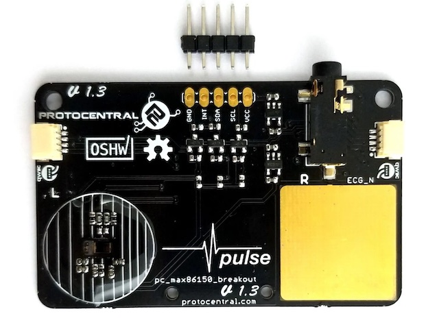
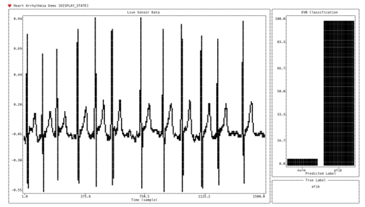

# EVB Demo

This demo shows running an end-to-end heart arrhythmia classifier on the Apollo 4 EVB. The basic flow chart is depicted below.


In the first stage, 5 seconds of sensor data is collected- either directly from the MAX86150 sensor or test data from the PC. In stage 2, the data is preprocessed by bandpass filtering and standardizing. The data is then fed into the CNN network to perform inference. Finally, in stage 4, the ECG data will be classified as normal, arrhythmia (AFIB) or inconclusive. Inconclusive is assigned when the prediction confidence is less than a pre-defined threshold (e.g. 90%).

> NOTE: The reference arrhythmia model has already been converted into TFLM model and located at `evb/src/model_buffer.h`

## Software Setup

In order to compile the EVB binary, both [Arm GNU Toolchain](https://developer.arm.com/downloads/-/arm-gnu-toolchain-downloads) and [Segger J-Link](https://www.segger.com/downloads/jlink/) must be installed on the host PC. After installing, ensure they are both available from the terminal. (e.g `which arm-none-eabi-gcc`)

## Hardware Setup

### Required Hardware

* [Apollo4 EVB](https://ambiq.com/apollo4/)
* [MAX86150 Eval Board](https://protocentral.com/product/protocentral-max86150-ppg-and-ecg-breakout-with-qwiic-v2/)
* 2x USB-C cables
* Jumper wires

### 1. Connect EVB to MAX86150 breakout

In order to connect the MAX86150 breakout board to the Apollo 4 EVB, we must first solder the 5-pin header on to the MAX86150 board.



Once soldered, connect the breakout board to the EVB using 5 jumper wires as follows:

| Breakout    | Apollo 4 EVB      |
| ----------- | ----------------- |
| VCC         | J17 pin 2 (5V)    |
| SCL         | J11 pin 3 (GPIO8) |
| SDA         | J11 pin 1 (GPIO9) |
| INT         | Not used          |
| GND         | J17 pin 4 (GND)   |


> NOTE: Alternatively, the Qwiic connector on the breakout board can be used. This will require a Qwiic breakout cable. For 3V3, J3 pin 5 (3.3V) can be leveraged on the EVB.

### 2. Connect EVB to host PC

Next, connect the EVB to your laptop using both USB-C ports on the EVB.

> NOTE: Quality of ECG from the onboard pads depends on contact quality and will produce more artifacts. For a better quality ECG, it is recommended that the accompanying ECG cable be used with electrodes. Place blue electrode on left wrist/finger/arm and red electrode on right wrist/finger/arm. Optionally, the black ground elecrode can be placed on the body to further improve SNR.

## Running the Demo

Please open two terminals to ease running the demo. We shall refer to these as __Terminal A__ and __Terminal B__.

### 1. Run client on EVB

Run the following commands in terminal A. This will compile the EVB binary and flash it to the EVB. The binary will be located in `./evb/build`.

```bash
make -C ./evb
make -C ./evb deploy
make -C ./evb view
```

Now press the __reset button__ on the EVB. This will allow SWO output to be captured.

### 2. Run server on host PC

In terminal B, start the server on the PC.

```bash
python -m ecgarr evb_demo --config-file ./configs/evb-demo.json
```

Upon start, the server will scan and connect to the EVB serial port. If no port is detected after 30 seconds, the server will exit. If successful, the server should discover the USB port and say `Server running`.

### 3. Trigger start

Now that the EVB client and PC server are running, press either Button 1 (BTN1) or Button 2 (BTN2) on the EVB to start the demo. Pressing Button 1, will use live sensor data whereas Button 2 will use test dataset supplied by the PC. In terminal A, the EVB should be printing the stage it's in (e.g `INFERENCE STAGE`) and any results. In terminal B, the PC should be plotting the data along with classification results. If labelled dataset is being used, the true label will be displayed in the __True Label Panel__. Once finished, Button 1 or Button 2 can be pressed to start the next capture.



> NOTE: Please use a monospaced font in the terminal for proper alignment of the plot.

To shutdown the PC server, a keyboard interrupt can be used (e.g `[CTRL]+C`).
