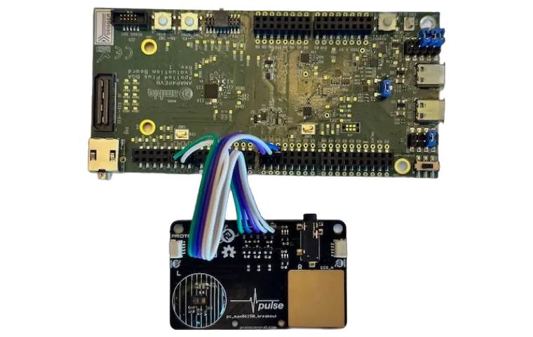

# EVB Setup & Compiling

## Requirements

### Software

In order to compile the EVB binary, both [Arm GNU Toolchain](https://developer.arm.com/downloads/-/arm-gnu-toolchain-downloads) and [Segger J-Link](https://www.segger.com/downloads/jlink/) must be installed on the host PC. After installing, ensure they are both available from the terminal. (e.g `which arm-none-eabi-gcc`)

* [Arm GNU Toolchain 11.3](https://developer.arm.com/downloads/-/arm-gnu-toolchain-downloads)
* [Segger J-Link v7.56+](https://www.segger.com/downloads/jlink/)

### Hardware

The following items are needed to flash firmware and run demos.

* [Apollo4 EVB](https://ambiq.com/apollo4/)
* [MAX86150 Eval Board](https://protocentral.com/product/protocentral-max86150-ppg-and-ecg-breakout-with-qwiic-v2/)
* 2x USB-C cables
* Jumper wires _-OR-_ Qwiic cable

## Hardware Setup

In order to connect the MAX86150 breakout board to the Apollo 4 EVB, we must first solder the 5-pin header on to the MAX86150 board.

Once soldered, connect the breakout board to the EVB using 5 jumper wires as follows:

| Breakout    | Apollo 4 EVB      |
| ----------- | ----------------- |
| VCC         | J17 pin 2 (5V)    |
| SCL         | J11 pin 3 (GPIO8) |
| SDA         | J11 pin 1 (GPIO9) |
| INT         | Not used          |
| GND         | J17 pin 4 (GND)   |

!!! note
    Alternatively, the Qwiic connector on the breakout board can be used. This will require a Qwiic breakout cable. For 3V3, J3 pin 5 (3.3V) can be leveraged on the EVB.

## Firmware Setup

Connect the EVB to your laptop using both USB-C ports on the EVB.

!!! note
    Quality of ECG from the onboard pads depends on contact quality and will produce more artifacts. For a better quality ECG, it is recommended that the accompanying ECG cable be used with electrodes. Place blue electrode on left wrist/finger/arm and red electrode on right wrist/finger/arm. Optionally, the black ground electrode can be placed on the body to further improve SNR.

## Firmware Commands

| Name  | Command                | Description           |
| ----- | ---------------------- | --------------------- |
| Clean | `make -C ./evb clean`  | Clean build artifacts |
| Build | `make -C ./evb`        | Compile binary        |
| Flash | `make -C ./evb deploy` | Flash binary to EVB   |
| View  | `make -C ./evb view`   | View SWO Output       |
