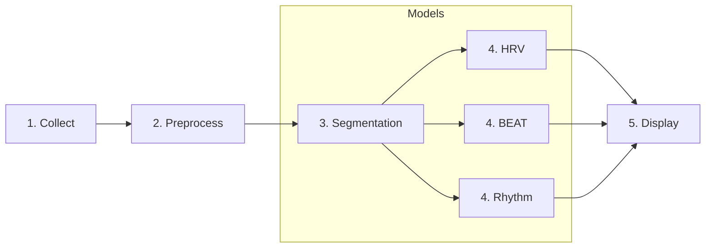

# :octicons-heart-fill-24:{ .heart } HeartKit Tutorial

## Overview

HeartKit demo highlights a number of key features of the HeartKit library including.  By leveraging a modern multi-head network architecture coupled with Ambiq's ultra low-power SoC, the demo is designed to be **efficient**, **explainable**, and **extensible**.

The architecture consists of an **ECG segmentation** model followed by three upstream heads: **HRV head**, **rhythm head**, and **beat head**. The ECG segmentation model serves as the backbone and is used to annotate every sample as either P-wave, QRS, T-wave, or none. The rhythm head is used to detect the presence of Atrial Fibrillation (AFIB) or Atrial Flutter (AFL). The HRV head is used to calculate heart rate, rhythm (e.g., bradycardia), and heart rate variability from the R peaks. Lastly, the beat head is used to identify individual irregular beats (PAC, PVC).

This tutorial shows running the full HeartKit demonstrator on the Apollo 4 EVB. The basic flow chart is depicted below.



In the first stage, 10 seconds of sensor data is collected- either directly from the MAX86150 sensor or test data from the PC. In stage 2, the data is preprocessed by bandpass filtering and standardizing. The data is then fed into the HeartKit models to perform inference. Finally, in stage 4, the ECG data and classification results will be displayed in the front-end UI.

---

## Architecture

HeartKit demo leverages a multi-head network- a backbone segmentation model followed by 3 upstream heads:

* __Segmentation backbone__ utilizes a custom 1-D UNET architecture to perform ECG segmentation.
* __HRV head__ utilizes segmentation results to derive a number of useful metrics including heart rate, rhythm and RR interval.
* __Rhythm head__ utilizes a 1-D MBConv CNN to detect arrhythmias include AFIB and AFL.
* __Beat-level head__ utilizes a 1-D MBConv CNN to detect irregular individual beats (PAC, PVC).


### ECG Segmentation

The ECG segmentation model serves as the backbone and is used to annotate every sample as either P-wave, QRS, T-wave, or none. The resulting ECG data and segmentation mask is then fed into upstream “heads”. This model utilizes a custom 1-D UNET architecture w/ additional skip connections between encoder and decoder blocks. The encoder blocks are convolutional based and include both expansion and inverted residuals layers. The only preprocessing performed is band-pass filtering and standardization on the window of ECG data.

### HRV Head

The HRV head uses only DSP and statistics (i.e. no neural network is used). Using a combination of segmentation results and QRS filter, the HRV head detects R peak candidates. RR intervals are extracted and filtered, and then used to derive a variety of HRV metrics including heart rate, rhythm, SDNN, SDRR, SDANN, etc. All of the identified R peaks are further fed to the beat classifier head. Note that if segmentation model is not enabled, HRV head falls back to identifying R peaks purely on gradient of QRS signal.

### Rhythm Head

The rhythm head is used to detect the presence of Atrial Fibrillation (AFIB) or Atrial Flutter (AFL). Note that if heart rhythm is detected, the remaining heads are skipped. The rhythm model utilizes a 1-D CNN built using MBConv style blocks that incorporate expansion, inverted residuals, and squeeze and excitation layers. Furthermore, longer filter and stide lengths are utilized in the initial layers to capture more temporal dependencies.

### Beat Head

The beat head is used to extract individual beats and classify them as either normal, premature/ectopic atrial contraction (PAC), premature/ectopic ventricular contraction (PVC), or noise. In addition to the target beat, the surrounding beats are also fed into the network as context. The “neighboring” beats are determined based on the average RR interval and not the actual R peak. The beat head also utilizes a 1-D CNN built using MBConv style blocks.

---

## Demo Setup

Please follow [EVB Setup Guide](./evb-setup.md) to prepare EVB and connect to PC. To use the pre-trained models, please skip to [Run Demo Section](#run-demo).

### 1. Train all the models

1.1 Train and fine-tune the segmentation model:

```bash
heartkit \
    --task segmentation \
    --mode train \
    --config ./configs/pretrain-segmentation-model.json
```

```bash
heartkit \
    --task segmentation \
    --mode train \
    --config ./configs/train-segmentation-model.json
```

!!! note
    The second train command uses quantization-aware training to reduce accuracy drop when exporting to 8-bit.

1.2 Train the rhythm model:

```bash
heartkit \
    --task rhythm \
    --mode train \
    --config ./configs/train-rhythm-model.json
```

1.3 Train the beat model:

```bash
heartkit \
    --task beat \
    --mode train \
    --config ./configs/train-beat-model.json
```

---

### 2. Evaluate all the models

2.1 Evaluate the segmentation model performance:

```bash
heartkit \
    --task segmentation \
    --mode evaluate \
    --config ./configs/evaluate-segmentation-model.json
```

2.2 Evaluate the rhythm model performance:

```bash
heartkit \
    --task rhythm \
    --mode evaluate \
    --config ./configs/evaluate-rhythm-model.json
```

2.3 Evaluate the beat model performance:

```bash
heartkit \
    --task beat \
    --mode evaluate \
    --config ./configs/evaluate-beat-model.json
```

### 3. Export all the models

3.1 Export the segmentation model to `./evb/src/segmentation_model_buffer.h`

```bash
heartkit \
    --task segmentation \
    --mode export \
    --config ./configs/export-segmentation-model.json
```

3.2 Export the rhythm model to `./evb/src/arrhythmia_model_buffer.h`

```bash
heartkit \
    --task rhythm \
    --mode export \
    --config ./configs/export-rhythm-model.json
```

3.3 Export the beat model to `./evb/src/beat_model_buffer.h`

```bash
heartkit \
    --task beat \
    --mode export \
    --config ./configs/export-beat-model.json
```

!!! note
    Review `./evb/src/constants.h` and ensure settings match configuration file.

---

## Run Demo

Please open three terminals to ease running the demo. We shall refer to these as __EVB Terminal__, __REST Terminal__ and __PC Terminal__.

### 1. Run client on EVB

Run the following commands in the __EVB Terminal__. This will compile the EVB binary and flash it to the EVB. The binary will be located in `./evb/build`.

```bash
make -C ./evb
make -C ./evb deploy
make -C ./evb view
```

Now press the __reset button__ on the EVB. This will allow SWO output to be captured.

### 2. Run REST server on host PC

In __REST Terminal__, start the REST server on the PC.

```bash
uvicorn heartkit.demo.server:app --host 0.0.0.0 --port 8000
```

### 3. Run client and UI on host PC

In __PC Terminal__, start the PC client (console UI).

```bash
heartkit --mode demo --config ./configs/heartkit-demo.json
```

Upon start, the client will scan and connect to the EVB serial port. If no port is detected after 30 seconds, the client will exit. If successful, the client should discover the USB port and start updating UI.

### 4. Trigger start

Now that the EVB client, PC client, and PC REST server are running, press either __Button 1 (BTN1)__ or __Button 2 (BTN2)__ on the EVB to start the demo. Pressing Button 1 will use live sensor data whereas Button 2 will use test dataset supplied by the PC. In __EVB Terminal__, the EVB should be printing the stage it's in (e.g `INFERENCE STAGE`) and any results. In __PC Terminal__, the PC should be plotting the data along with classification results. Once finished, Button 1 or Button 2 can be pressed to stop capturing.


To shutdown the PC client, a keyboard interrupt can be used (e.g `[CTRL]+C`) in __PC Terminal__.
Likewise, a keyboard interrupt can be used (e.g `[CTRL]+C`) to stop the PC REST server in __REST Terminal__.

---
