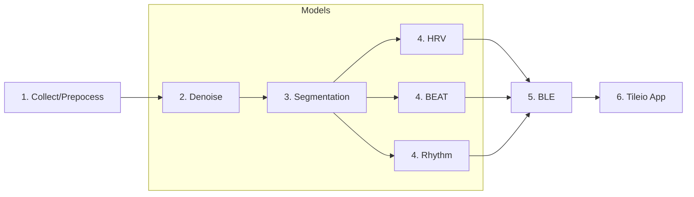
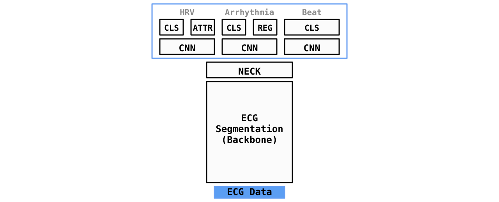
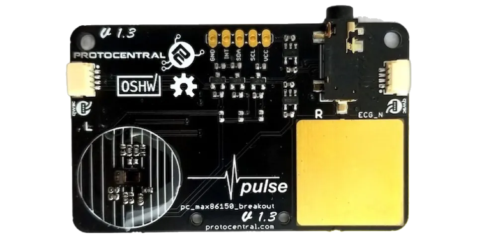
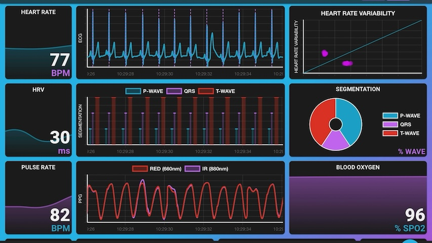

# :octicons-heart-fill-24:{ .heart } HeartKit: AI Heart Analysis Demo

## Overview

The HeartKit: AI Heart Analysis demo is a real-time, ECG-based heart analysis demonstrator that showcases several AI models trained using Ambiq's open-source HeartKit ADK. By leveraging a modern multi-head network architecture coupled with Ambiq's ultra low-power SoC, the demo is designed to be **efficient**, **explainable**, and **extensible**.

The architecture consists of 1-lead ECG data collected in real-time from a MAX86150 sensor. The data is preprocessed using an AI based denoising model followed by an ECG segmentation model. The segmentation model is used to annotate every sample as either P-wave, QRS, T-wave, or none. The resulting ECG data and segmentation mask is then fed into upstream “heads” to perform inference. The upstream heads include a HRV head, a rhythm head, and a beat head. The HRV head is used to calculate heart rate, rhythm, and heart rate variability from the segmented QRS peaks. The rhythm head is used to detect the presence of arrhythmias including Atrial Fibrillation (AFIB) and Atrial Flutter (AFL). The beat model is used to classify individual irregular beats as either normal or ectopic.

In the first stage, 5 seconds of sensor data is collected- either from stored subject data or directly from the MAX86150 sensor. In stage 2, the ECG data is denoised and in stage 3 is segmented. In stage 4, the cleaned, segmented data is fed into the upstream HeartKit models to perform inference. Finally, in stage 5, the ECG data and metrics are streamed over BLE to Tileio App to be displayed in a dashboard.

---

## Architecture

The HeartKit demo leverages a multi-head network- a backbone denoising and segmentation model followed by 3 upstream heads:

* [__Denoising model__](../tasks/denoise.md) utilizes a small 1-D TCN architecture to remove noise from the ECG signal.
* [__Segmentation model__](../tasks/segmentation.md) utilizes a small 1-D TCN architecture to perform ECG segmentation.
* [__Rhythm head__](../tasks/rhythm.md) utilizes a 1-D MBConv CNN to detect arrhythmias include AFIB and AFL.
* [__Beat-level head__](../tasks/beat.md) utilizes a 1-D MBConv CNN to detect irregular individual beats (PAC, PVC).
* __HRV head__ utilizes segmentation results to derive a number of useful metrics including heart rate and heart rate variability (HRV).

<!--  -->

---

## Demo Setup

### Contents

The following items are needed to run the HeartKit demo:

* 1x Apollo4 Blue Plus EVB
* 1x MAX86150 Breakout Board
* 1x iPad or laptop w/ Chrome Browser
* 1x USB-C battery pack for EVB
* 2x USB-C cables
* 1x Qwiic cable

!!! note
    Please be sure to run the EVB from battery when using live sensor data. In addition, be sure to minimize sorrounding EMI/RFI noise as the exposed sensor board's ECG pads are highly sensitive.

### Flash Firmware

If using a fresh Apollo 4 EVB, the EVB will need to be flashed with the HeartKit firmware. The instructions to compile and flash the firmware can be found in [Tileio Demos](https://github.com/AmbiqAI/tileio-demos/tree/main/heartkit).

### Hardware Setup

In order to connect the MAX86150 breakout board to the EVB, we leverage the Qwiic connector on the breakout board. This will require a Qwiic breakout cable. For 3V3, use a jumper to connect Vext to 3V3 power rail. Then connect the cable as follows:

| Qwiic Cable  | EVB Board         |
| ------------ | ----------------- |
| Power (RED)  | VCC   (J17 pin 1) |
| GND (BLACK)  | GND   (J11 pin 3) |
| SCL (YELLOW) | GPIO8 (J11 pin 3) |
| SDA (BLUE)   | GPIO9 (J11 pin 1) |

<figure markdown>
  { width="480" }
  <figcaption>MAX86150 Sensor Board</figcaption>
</figure>

---

## Run Demo

1. Connect the MAX86150 breakout board to the EVB using the Qwiic cable.

2. Power on the EVB using the USB-C battery pack.

3. Launch Tileio app on your iPad or go to [Tileio Web](https://ambiqai.github.io/tileio) using a Desktop Chrome browser.

4. If this is a new device, click on the "+" icon on the top right corner to add a new device.

    1. Scan and select device.
    2. Configure device manually or upload [device configuration file](https://github.com/AmbiqAI/tileio-demos/blob/d4a6806e404dab04eaf30db92fa2ae1d6d474c79/assets/device-configs/hk-device-config.json).
    3. Review and select "ADD" to add device.

5. On “Devices view”, scan for devices. The device should turn opaque and say "ONLINE".

6. Tap on the target device Tile to display the device dashboard.

7. In the device dashboard, tap the BLE( :material-bluetooth: ) icon to connect to the device.

8. If this is a new device, go to the "Settings" and configure the dashboard Tiles. Upload the [dashboard configuration file](https://github.com/AmbiqAI/tileio-demos/blob/d4a6806e404dab04eaf30db92fa2ae1d6d474c79/assets/dashboard-configs/hk-dashboard-config.json)

9. After 5 seconds, live data should start streaming to the Tileio app.

10. Use the "Input Select" to switch subject ECG input and "Noise Input" slider to inject additional noise.

---
