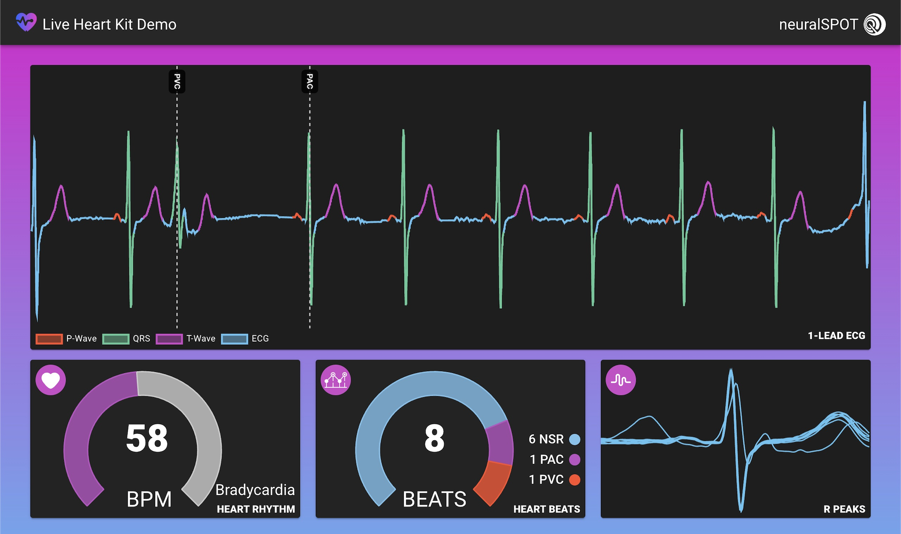

# ♥️ Heart Kit Tutorial

This demo shows running Heart Kit demonstrator on the Apollo 4 EVB. The basic flow chart is depicted below.


In the first stage, 10 seconds of sensor data is collected- either directly from the MAX86150 sensor or test data from the PC. In stage 2, the data is preprocessed by bandpass filtering and standardizing. The data is then fed into the Heart Kit models to perform inference. Finally, in stage 4, the ECG data and classification results will be displayed in frontend UI.

## Demo Setup

Please follow [EVB Setup](./evb-setup.md) guide to prepare EVB and connect to PC.

>NOTE: To use the pre-trained models, please skip to [Run Demo](#run-demo) section.

## Train Models

Train the segmentation model:

```bash
heartkit --task segmentation --mode train --config ./configs/train-segmentation-model.json
```

Train the arrhythmia model:

```bash
heartkit --task arrhythmia --mode train --config ./configs/train-arrhythmia-model.json
```

Train the beat model:

```bash
heartkit --task beat --mode train --config ./configs/train-beat-model.json
```

## Evaluate Models

Evaluate the segmentation model performance:

```bash
heartkit --task segmentation --mode evaluate --config ./configs/evaluate-segmentation-model.json
```

Evaluate the arrhythmia model performance:

```bash
heartkit --task arrhythmia --mode evaluate --config ./configs/evaluate-arrhythmia-model.json
```

Evaluate the beat model performance:

```bash
heartkit --task beat --mode evaluate --config ./configs/evaluate-beat-model.json
```

## Export Models

Export the segmentation model to `./evb/src/segmentation_model_buffer.h`

```bash
heartkit --task segmentation --mode export --config ./configs/export-segmentation-model.json
```

Export the arrhythmia model to `./evb/src/arrhythmia_model_buffer.h`

```bash
heartkit --task arrhythmia --mode export --config ./configs/export-arrhythmia-model.json
```

Export the beat model to `./evb/src/beat_model_buffer.h`

```bash
heartkit --task beat --mode export --config ./configs/export-beat-model.json
```

>NOTE: Review `./evb/src/constants.h` and ensure settings match configuration file.

## Run Demo

Please open three terminals to ease running the demo. We shall refer to these as __EVB Terminal__, __REST Terminal__ and __PC Terminal__.

### 1. Run client on EVB

Run the following commands in the __EVB Terminal__. This will compile the EVB binary and flash it to the EVB. The binary will be located in `./evb/build`.

```bash
make -C ./evb
make -C ./evb deploy
make -C ./evb view
```

Now press the __reset button__ on the EVB. This will allow SWO output to be captured.

### 2. Run REST server on host PC

In __REST Terminal__, start the REST server on the PC.

```bash
uvicorn heartkit.demo.server:app --host 0.0.0.0 --port 8000
```

### 3. Run client and UI on host PC

In __PC Terminal__, start the PC client (console UI).

```bash
heartkit --mode demo --config ./configs/heartkit-demo.json
```

Upon start, the client will scan and connect to the EVB serial port. If no port is detected after 30 seconds, the client will exit. If successful, the client should discover the USB port and start updating UI.

### 4. Trigger start

Now that the EVB client, PC client, and PC REST server are running, press either __Button 1 (BTN1)__ or __Button 2 (BTN2)__ on the EVB to start the demo. Pressing Button 1, will use live sensor data whereas Button 2 will use test dataset supplied by the PC. In __EVB Terminal__, the EVB should be printing the stage it's in (e.g `INFERENCE STAGE`) and any results. In __PC Terminal__, the PC should be plotting the data along with classification results. Once finished, Button 1 or Button 2 can be pressed to stop capturing.



To shutdown the PC client, a keyboard interrupt can be used (e.g `[CTRL]+C`) in __PC Terminal__.
Likewise, a keyboard interrupt can be used (e.g `[CTRL]+C`) to stop the PC REST server in __REST Terminal__.
