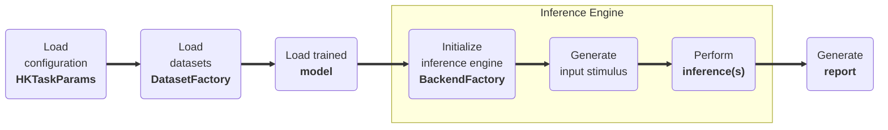

# Task-Level Demo

## <span class="sk-h2-span">Introduction </span>

Each task in HeartKit has a corresponding demo mode that allows you to run a task-level demonstration using the specified backend inference engine (e.g. PC or EVB). This is useful to showcase the model's performance in real-time and to verify its accuracy in a real-world scenario. Similar to other modes, the demo can be invoked either via CLI or within `heartkit` python package. At a high level, the demo mode performs the following actions based on the provided configuration parameters:

1. Load the configuration data (e.g. `configuration.json`)
1. Load the desired datasets (e.g. `icentia11k`)
1. Load the trained model (e.g. `model.keras`)
1. Initialize inference engine backend (e.g. `pc` or `evb`)
1. Generate input data (e.g. `x, y`)
1. Perform inference on backend (e.g. `model.predict`)
1. Generate report (e.g. `report.html`)




---

## <span class="sk-h2-span">Backend Inference Engines</span>

HeartKit includes two built-in backend inference engines: PC and EVB. Additional backends can be easily added to the HeartKit framework by creating a new backend class and registering it to the backend factory, `BackendFactory`.

### PC Backend Inference Engine

The PC backend is used to run the task-level demo on the local machine via `Keras`. This is useful for quick testing and debugging of the model.

1. Create / modify configuration file (e.g. `configuration.json`)
1. Ensure "pc" is selected as the backend in configuration file.
1. Run demo `heartkit --mode demo --task segmentation --config ./configuration.json`
1. HTML report will be saved to `${job_dir}/report.html`

### EVB Backend Inference Engine

The EVB backend is used to run the task-level demo on an Ambiq EVB. This is useful to showcase the model's performance in real-time and to verify its accuracy on deployed hardware.

1. Create / modify configuration file (e.g. `configuration.json`)
1. Ensure "evb" is selected as the `backend` in configuration file.
1. Plug EVB into PC via two USB-C cables.
1. Run demo `heartkit --mode demo --task beat --config ./configuration.json`
1. HTML report will be saved to `${job_dir}/report.html`

### Bring-Your-Own-Backend Engine

Similar to datasets, dataloaders, tasks, and models, the demo mode can be customized to use your own backend inference engine. HeartKit includes a backend factory (`BackendFactory`) that is used to create and run the backend engine.

#### How it Works

1. **Create a Backend**: Define a new backend class that inherits from the [HKInferenceBackend](/heartkit/api/heartkit/backends/backend) base class and implements the required abstract methods.

    ```py linenums="1"
    import heartkit as hk

    class CustomBackend(hk.HKInferenceBackend):
        """Custom backend inference engine"""

        def __init__(self, params: hk.HKTaskParams) -> None:
            self.params = params

        def open(self):
            """Open backend"""
            pass

        def close(self):
            """Close backend"""
            pass

        def set_inputs(self, inputs: npt.NDArray):
            """Set inputs"""
            pass

        def perform_inference(self):
            """Perform inference"""
            pass

        def get_outputs(self) -> npt.NDArray:
            """Get outputs"""
            pass
    ```

2. **Register the Backend**: Register the new backend with the [BackendFactory](/heartkit/api/heartkit/backends/backend) by calling the `register` method. This method takes the backend name and the backend class as arguments.

    ```py linenums="1"
    import heartkit as hk

    # Register the custom backend
    hk.BackendFactory.register("custom", CustomBackend)
    ```

3. **Use the Backend**: The new backend can now be used by setting the `backend` flag in the demo configuration settings.

    ```py linenums="1"
    import heartkit as hk

    # Define demo parameters
    params = hk.HKTaskParams(...)
    params.backend = "custom"

    # Load the desired task
    task = hk.TaskFactory.get("rhythm")

    # Run the task-level demo using the custom backend
    task.demo(params=params)
    ```

---

## <span class="sk-h2-span">Usage </span>

The following is an example of a task-level demo report for the segmentation task. Upon running segmentation, the demo will extract inter-beat-intervals (IBIs) and report various HR and HRV metrics. These metrics are computed using Ambiq's [PhysioKit Python Package](https://ambiqai.github.io/physiokit)- a toolkit to process raw ambulatory bio-signals.

=== "CLI"

    ```bash
    heartkit -m export -t segmentation -c ./configuration.json
    ```

=== "Python"

    --8<-- "assets/modes/python-demo-snippet.md"


<div class="sk-plotly-graph-div">
--8<-- "assets/tasks/segmentation/segmentation-demo.html"
</div>

---

## <span class="sk-h2-span">Arguments </span>

Please refer to [HKTaskParams](../modes/configuration.md) for the list of arguments that can be used with the `demo` command.

---
