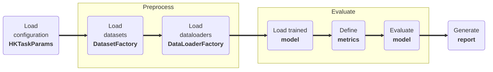

# Model Evaluation

## <span class="sk-h2-span">Introduction </span>

Evaluate mode is used to test the performance of the model on the reserved test set for the specified task. Similar to training, the routine can be customized via CLI configuration file or by setting the parameters directly in the code. The evaluation process involves testing the model's performance on the test data to measure its accuracy, precision, recall, and F1 score. A number of results and metrics will be generated and saved to the `job_dir`.

<div class="annotate" markdown>


1. Load the configuration data (e.g. `configuration.json` (1))
1. Load the desired datasets (e.g. `PtbxlDataset`)
1. Load the corresponding task dataloaders (e.g. `PtbxlDataLoader`)
1. Load the trained model (e.g. `model.keras`)
1. Define the metrics (e.g. `accuracy`)
1. Evaluate the model (e.g. `model.evaluate`)
1. Generate evaluation report (e.g. `report.json`)

</div>

1. Example configuration:
--8<-- "assets/usage/json-configuration.md"





---

## <span class="sk-h2-span">Usage</span>

### CLI

The following command will evaluate a rhythm model using the reference configuration.

```bash
heartkit --task rhythm --mode evaluate --config ./configuration.json
```

### Python

The model can be evaluated using the following snippet:

```python

task = hk.TaskFactory.get("rhythm")

params = hk.HKTaskParams(...)  # (1)

task.evaluate(params)

```

1. Example configuration:
--8<-- "assets/usage/python-configuration.md"

---

## <span class="sk-h2-span">Arguments </span>

Please refer to [HKTaskParams](../modes/configuration.md#hktaskparams) for the list of arguments that can be used with the `evaluate` command.
