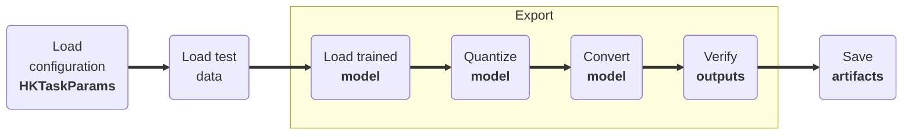

# Model Exporting

## <span class="sk-h2-span">Introduction </span>

Export mode is used to convert the trained TensorFlow model into a format that can be used for deployment onto Ambiq's family of SoCs. Currently, the command will convert the TensorFlow model into both TensorFlow Lite (TFL) and TensorFlow Lite for micro-controller (TFLM) variants. The command will also verify the models' outputs match. The activations and weights can be quantized by configuring the `quantization` section in the configuration file or by setting the `quantization` parameter in the code.

<div class="annotate" markdown>

1. Load the configuration data (e.g. `configuration.json` (1))
1. Load the test data (e.g. `test.pkl`)
1. Load the trained model (e.g. `model.keras`)
1. Quantize the model (e.g. `16x8`)
1. Convert the model (e.g. `TFL`, `TFLM`)
1. Verify the models' outputs match
1. Save artifacts (e.g. `model.tflite`)

</div>

1. Example configuration:
--8<-- "assets/usage/json-configuration.md"




---

## <span class="sk-h2-span">Usage</span>

### CLI

The following command will export a rhythm model using the reference configuration.

```bash
heartkit --task rhythm --mode export --config ./configuration.json
```

### Python

The model can be evaluated using the following snippet:

```py linenums="1"

task = hk.TaskFactory.get("rhythm")

params = hk.HKTaskParams(...)  # (1)

task.export(params)

```

1. Example configuration:
--8<-- "assets/usage/python-configuration.md"

---

## <span class="sk-h2-span">Arguments </span>

Please refer to [HKTaskParams](../modes/configuration.md#hktaskparams) for the list of arguments that can be used with the `export` command.
