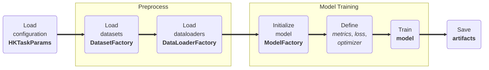

# Model Training

## <span class="sk-h2-span">Introduction </span>

Each task provides a mode to train a model on the specified datasets and dataloaders. The training mode can be invoked either via CLI or within `heartkit` python package. At a high level, the training mode performs the following actions based on the provided configuration parameters:

<div class="annotate" markdown>

1. Load the configuration parameters (e.g. `configuration.json` (1))
1. Load the desired datasets (e.g. `PtbxlDataset`)
1. Load the corresponding task dataloaders (e.g. `PtbxlDataLoader`)
1. Initialize custom model architecture (e.g. `tcn`)
1. Define the metrics, loss, and optimizer (e.g. `accuracy`, `categorical_crossentropy`, `adam`)
1. Train the model (e.g. `model.fit`)
1. Save artifacts (e.g. `model.keras`)

</div>

1. Example configuration:
--8<-- "assets/usage/json-configuration.md"

<br/>



---

## <span class="sk-h2-span">Usage</span>

### CLI

The following command will train a rhythm model using the reference configuration.

```bash
heartkit --task rhythm --mode train --config ./configuration.json
```

### Python

The model can be trained using the following snippet:

```python

task = hk.TaskFactory.get("rhythm")

params = hk.HKTaskParams(...)  # (1)

task.train(params)

```

1. Example configuration:
--8<-- "assets/usage/python-configuration.md"


---

## <span class="sk-h2-span">Arguments </span>

Please refer to [HKTaskParams](../modes/configuration.md#hktaskparams) for the list of arguments that can be used with the `train` command.

---

## <span class="sk-h2-span">Logging</span>

__HeartKit__ provides built-in support for logging to several third-party services including [Weights & Biases](https://wandb.ai/site) (WANDB) and [TensorBoard](https://www.tensorflow.org/tensorboard).

### WANDB

The training mode is able to log all metrics and artifacts (aka models) to [Weights & Biases](https://wandb.ai/site) (WANDB). To enable WANDB logging, simply set environment variable `WANDB=1`. Remember to sign in prior to running experiments by running `wandb login`.


### TensorBoard

The training mode is able to log all metrics to [TensorBoard](https://www.tensorflow.org/tensorboard). To enable TensorBoard logging, simply set environment variable `TENSORBOARD=1`.
