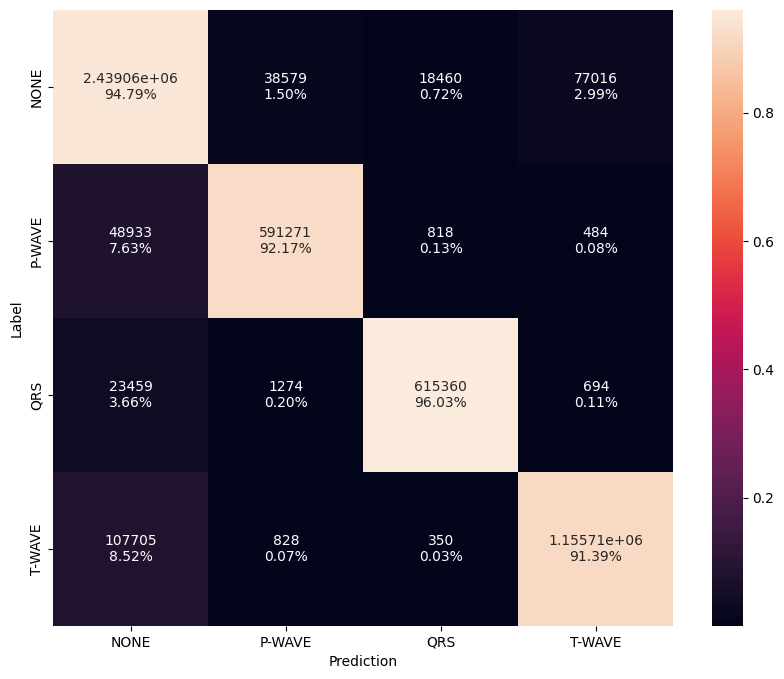
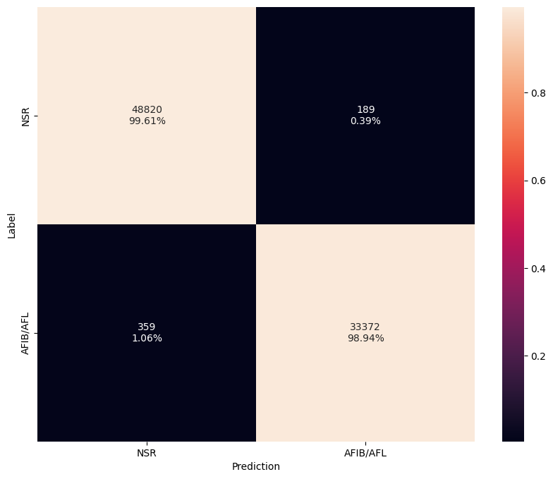

# Results

## Overview

The following table provides performance and accuracy results of all models when running on Apollo4 Plus EVB.

| Task           | Params   | FLOPS   | Metric     | Cycles/Inf | Time/Inf   |
| -------------- | -------- | ------- | ---------- | ---------- | ---------- |
| Segmentation   | 33K      | 6.5M    | 87.0% IOU  | 102M       | 531ms      |
| Arrhythmia     | 50K      | 3.6M    | 99.0% F1   | 89M        | 465ms      |
| Beat           | 73K      | 2.2M    | 91.5% F1   | 46M        | 241ms      |

## Segmentation Results

<figure markdown>
  { width="540" }
  <figcaption>Segmentation Confusion Matrix</figcaption>
</figure>

## Heart Arrhythmia Results

The results of the arrhythmia model when testing on 1,000 patients (not used during training) is summarized below. The baseline model is simply selecting the argmax of model outputs (`normal`, `AFIB/AFL`). The 75% confidence version adds inconclusive label that is assigned when softmax output is less than 75% for any model output.

| Metric   | Baseline | 75% Confidence |
| -------- | -------- | -------------- |
| Accuracy | 96.5%    | 99.1%          |
| F1 Score | 96.4%    | 99.0%          |
| Drop     |  0.0%    | 12.0%          |

The confusion matrix for the 75% confidence model is depicted below.

<figure markdown>
  { width="540" }
  <figcaption>Arrhythmia Confusion Matrix</figcaption>
</figure>

## Beat Classification Results

The results of three beat models when testing on 1,000 patients (not used during training) are summarized below. The 800x1 model serves as the baseline and classifies individual beats (1 channel) with a fixed time window of 800 ms (160 samples). The 2400x1 model increases the time window to 2,400 ms (480 samples) in order to include surrounding data as context. Increasing the time window increases the accuracy by over `10%` but also causes computation to increase by `3.5x`. The third and best model uses a time window of 800 ms to capture individual beats but includes two additional channels. Using the local average RR interval, the previous and subsequent `beats` are included as side channels. Unlike normal beats, premature and ectopic beats won't be aligned to neighboring beats and serves as useful context. This provides similar temporal resolution as 800x1 but reduces computation by `3.3x` while further improving accuracy by `1.7%`.

| Model      | 800x1  | 2400x1 | 800x3  |
| ---------- | ------ | ------ | ------ |
| Parameters | 73K    | 73K    | 73K    |
| FLOPS      | 2.1M   | 7.6M   | 2.2M   |
| Accuracy   | 78.2%  | 88.6%  | 90.3%  |
| F1 Score   | 77.5%  | 87.2%  | 90.1%  |

The confusion matrix for the 800x3 model is depicted below using a confidence threshold of 50%.

<figure markdown>
  { width="540" }
  <figcaption>Beat Confusion Matrix</figcaption>
</figure>

## HRV Results

The HRV metrics are computed using off-the-shelf definitions based purely on the output of the segmentation and beat models. The current metrics include heart rate, rhythm, and RR variation. We intend to include additional metrics later such as QTc along with frequency metrics.
