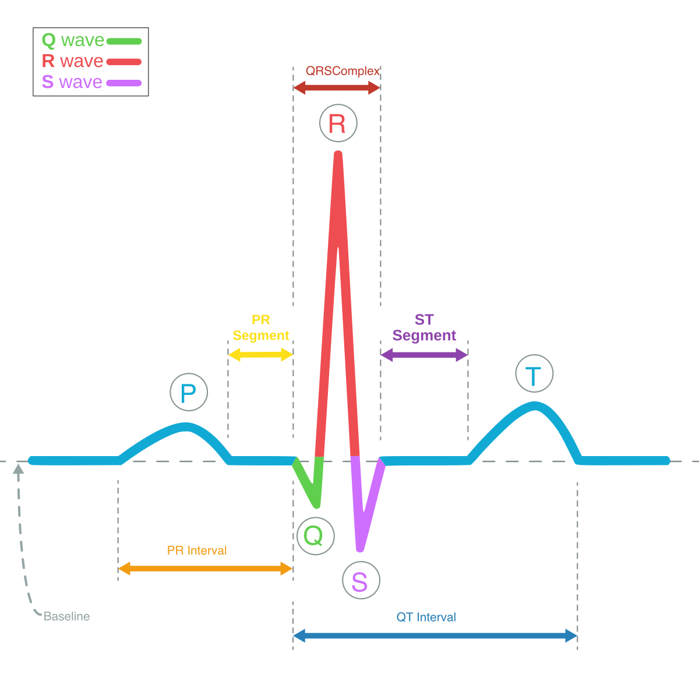

# ECG Segmentation Task

## Overview

The objective of ...

--8<-- "assets/pk_ecg_synthetic_nsr.html"

## Characteristics

* __P-Wave__: Reflects atrial depolarization
* __QRS Complex__: Reflects ventricular depolarization
* __T-Wave__: Reflects ventricular repolarization
* __U-Wave__: Reflects papillary muscle repolarization

<figure markdown>
  { width="320" }
  <figcaption>Annotated ECG Signal</figcaption>
</figure>
