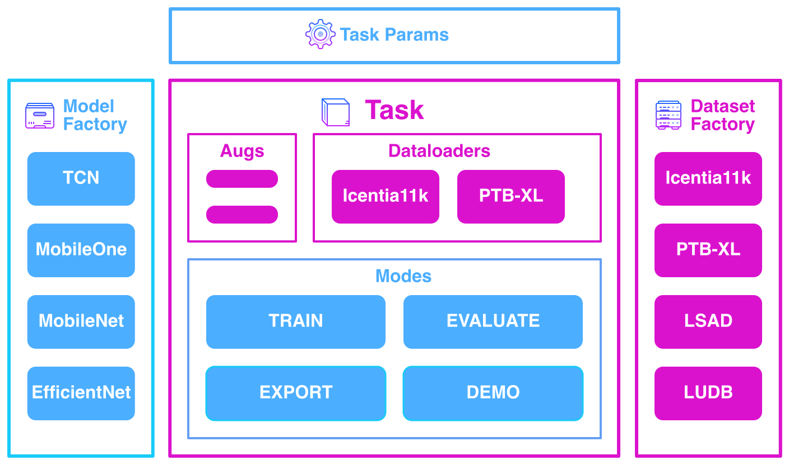

# :simple-task: Tasks

## <span class="sk-h2-span">Introduction</span>

HeartKit provides several built-in __heart-monitoring__ tasks. Each task is designed to address a unique aspect such as ECG denoising, segmentation, and rhythm/beat classification. The tasks are designed to be modular and can be used independently or in combination to address specific use cases. In addition to the built-in tasks, custom tasks can be created by extending the [HKTask](/heartkit/api/heartkit/tasks/task) base class and registering it with the task factory.

<figure markdown="span">
  { width="600" }
</figure>

---

## <span class="sk-h2-span">Available Tasks</span>

### <span class="sk-h2-span"> [Signal Denoise](./denoise.md)</span>

[Signal denoise](./denoise.md) is the process of removing noise from a physiological signal such as ECG. This task is useful for improving the quality of the signal and for further downstream tasks such as segmentation in which noise can interfere with the delineation of individual waves.

### <span class="sk-h2-span">[Signal Segmentation](./segmentation.md)</span>

[Signal segmentation](./segmentation.md) is the process of delineating a signal into its constituent parts. In the context of ECG, segmentation refers to delineating the ECG signal into individual waves (e.g. P-wave, QRS, T-wave). This task is useful for extracting features (e.g. HRV) from the ECG signal and for further analysis such as rhythm classification.

### <span class="sk-h2-span">[Rhythm Classification](./rhythm.md)</span>

[Rhythm classification](./rhythm.md) is the process of identifying abnormal heart rhythms, also known as arrhythmias, such as atrial fibrillation (AFIB) and atrial flutter (AFL) from ECG signals. Cardiovascular diseases such as AFIB are a leading cause of morbidity and mortality worldwide. Being able to remotely identify heart arrhtyhmias is important for early detection and intervention.

### <span class="sk-h2-span">[Beat Classification](./beat.md)</span>

[Beat classification](./beat.md) is the process of identifying and classifying individual heart beats such as normal, premature, and escape beats from ECG signals. By identifying abnormal heart beats, it is possible to detect and monitor various heart conditions.

<!-- ### <span class="sk-h2-span">[Diagnostic](./diagnostic.md)</span>

Multi-label diagnostic classification is the process of assigning diagnostic labels to an ECG signal. The diagnostic labels are structured in a hierarchical organization in terms of 5 coarse superclasses and 24 subclasses. -->

### <span class="sk-h2-span">[Bring-Your-Own-Task (BYOT)](./byot.md)</span>

[Bring-Your-Own-Task (BYOT)](./byot.md) is a feature that allows users to create custom tasks by extending the [HKTask](/heartkit/api/heartkit/tasks/task) base class and registering it with the `TaskFactory`. This feature is useful for addressing specific use cases that are not covered by the built-in tasks.

---

## <span class="sk-h2-span">Task Factory</span>

The task factory, `TaskFactory`, provides a convenient way to access the built-in tasks. The factory is a thread-safe singleton class that provides a single point of access to the tasks via the tasks' slug names. The benefit of using the factory is it allows registering custom tasks that can then be used just like built-in tasks.

The dataset factory provides the following methods:

* **hk.TaskFactory.register**: Register a custom task
* **hk.TaskFactory.unregister**: Unregister a custom task
* **hk.TaskFactory.has**: Check if a task is registered
* **hk.TaskFactory.get**: Get a task
* **hk.TaskFactory.list**: List all available tasks


```py linenums="1"

import heartkit as hk

# Grab a rhythm task
task = hk.TaskFactory.get("rhythm")

task.train(hk.HKTrainParams(
    ...
))

```

---

!!! Example "Recap"

    === "Signal Denoise"

        ### Signal Denoising

        Remove noise from physiological signals. <br>
        Refer to [Denoise Task](./denoise.md) for more details.

    === "Signal Segmentation"

        ### Signal Segmentation

        Delineate physiological signal into constituent parts. <br>
        Refer to [Segmentation Task](./segmentation.md) for more details.

    === "Rhythm"

        ### Rhythm Classification

        Identify rhythm-level arrhythmias such as AFIB and AFL. <br>
        Refer to [Rhythm Task](./rhythm.md) for more details.


    === "Beat"

        ### Beat Classification

        Identify premature and escape beats. <br>
        Refer to [Beat Task](./beat.md) for more details.

    <!-- === "Diagnostic"

        ### Diagnostic Classification

        Assign diagnostic labels to an ECG signal. <br>
        Refer to [Diagnostic Task](./diagnostic.md) for more details. -->

---
