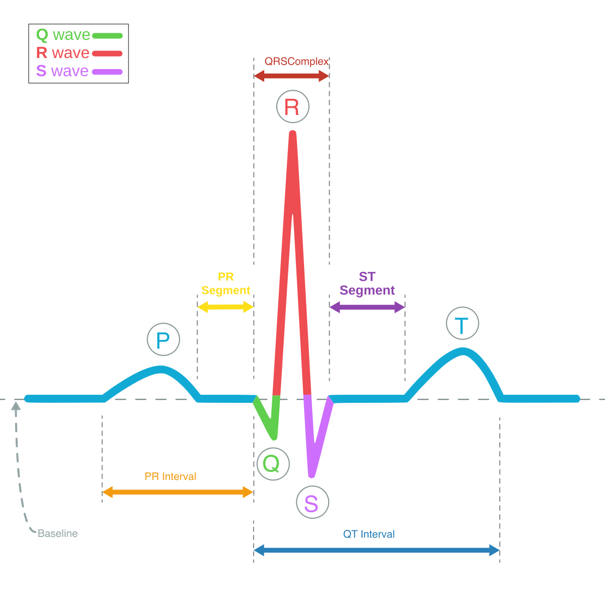

# Signal Segmentation Task

## <span class="sk-h2-span">Overview</span>

The objective of segmentation is to delineate key segments of the signal. In the context of ECG signals, this involves identifying the different components of the cardiac cycle, including the P-wave, QRS complex, and T-wave. These segments are used to compute a number of clinically relevant metrics, including heart rate, PR interval, QRS duration, QT interval, and QTc interval. For PPG, the task involves segmenting the systolic and diastolic phases of the cardiac cycle. Segmentation models are useful for detecting arrhythmias, heart rate variability, and other cardiac abnormalities.


<div class="sk-plotly-graph-div">
--8<-- "assets/tasks/segmentation/segmentation-example.html"
</div>

---

## <span class="sk-h2-span">ECG Characteristics</span>

<div class="grid cards" markdown>

- Annotated ECG Signal
    <figure markdown>
    { width="380" }
    </figure>


- ECG Segments/Fiducials
    * __P-Wave__: Reflects atrial depolarization
    * __QRS Complex__: Reflects ventricular depolarization
    * __T-Wave__: Reflects ventricular repolarization
    * __U-Wave__: Reflects papillary muscle repolarization
    * __PR Interval__: Time from atrial depolarization to ventricular depolarization
    * __QT Interval__: Time from ventricular depolarization to repolarization
    * __QTc Interval__: Corrected QT interval
    * __ST Segment__: Time between ventricular depolarization and repolarization
    * __J-Point__: Junction between QRS complex and ST segment
</div>

---

## <span class="sk-h2-span">PPG Characteristics</span>

* __Systolic Phase__: Reflects the contraction of the heart
* __Diastolic Phase__: Reflects the relaxation of the heart
* __Dicrotic Notch__: Reflects the closure of the aortic valve

---

## <span class="sk-h2-span">Dataloaders</span>

Dataloaders are available for the following datasets:

* **[LUDB](../datasets/ludb.md)**
* **[QTDB](../datasets/qtdb.md)**
* **[ECG Synthetic](../datasets/synthetic.md)**
* **[PPG Synthetic](../datasets/synthetic.md)**

---

## <span class="sk-h2-span">Pre-Trained Models</span>

The following table provides the latest performance and accuracy results for segmentation models. Additional result details can be found in [Model Zoo → Segmentation](../zoo/index.md).

--8<-- "assets/zoo/segmentation/segmentation-model-zoo-table.md"

---

## <span class="sk-h2-span">Target Classes</span>

Below outlines the classes available for segmentation. When training a model, the number of classes, mapping, and names must be provided. This allows for the most flexibility in the segmentation task.

--8<-- "assets/tasks/segmentation/segmentation-classes.md"

!!! example "Class Mapping Example"

    Below is an example of a class mapping for a 3-class segmentation model. The class map keys are the original class labels, and the values are the new class labels. Any class not included will be skipped.

    ```json
    {
        "num_classes": 3,
        "class_names": ["None", "QRS", "Noise"],
        "class_map": {
            "0": 0,  // Map None to None
            "1": 0,  // Map P-wave to None
            "2": 1,  // Map QRS to QRS
            "3": 0,  // Map T-wave to None
            "4": 0,  // Map U-wave to None
            "5": 2   // Map Noise to Noise
        }
    }
    ```

---
