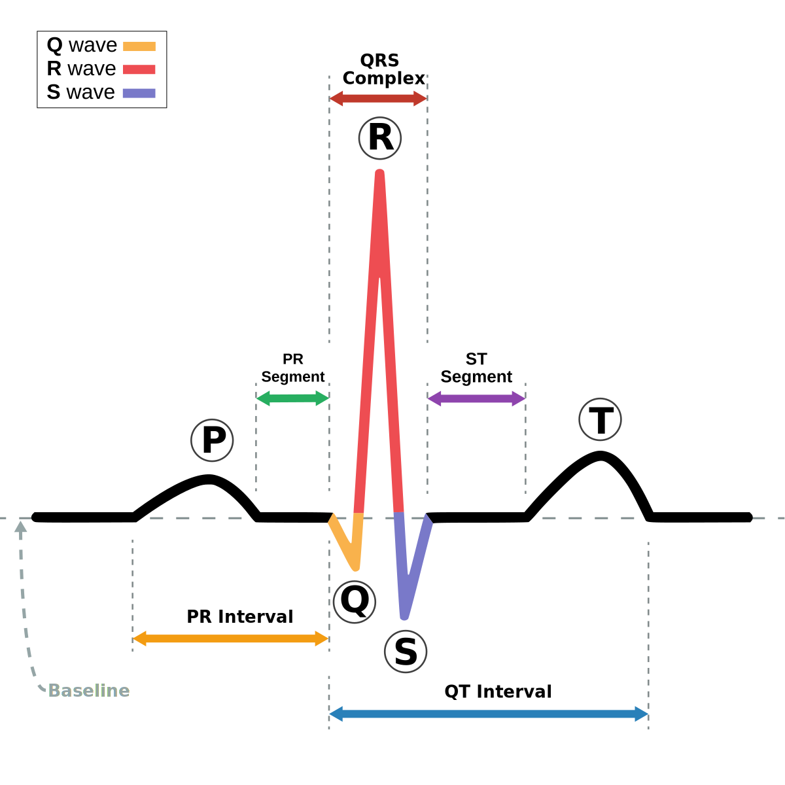

# ECG Segmentation Task

## <span class="sk-h2-span">Overview</span>

The objective of ECG segmentation is to delineate key segments of the cardiac cycle, including the P-wave, QRS complex, and T-wave. These segments are used to compute a number of clinically relevant metrics, including heart rate, PR interval, QRS duration, QT interval, and QTc interval. They are also useful for a variety of upstream tasks, including arrhythmia classification and beat classification.


<div class="sk-plotly-graph-div">
--8<-- "assets/pk_ecg_synthetic_nsr.html"
</div>

---

## <span class="sk-h2-span">Characteristics</span>


* __P-Wave__: Reflects atrial depolarization
* __QRS Complex__: Reflects ventricular depolarization
* __T-Wave__: Reflects ventricular repolarization
* __U-Wave__: Reflects papillary muscle repolarization


<figure markdown>
  { width="380" }
  <figcaption>Annotated ECG Signal</figcaption>
</figure>

---

## <span class="sk-h2-span">Pre-Trained Models</span>

The following table provides the latest performance and accuracy results for ECG segmentation models. Additional result details can be found in [Model Zoo → Segmentation](../zoo/segmentation.md).

--8<-- "assets/segmentation-model-zoo-table.md"

---


## <span class="sk-h2-span">Target Classes</span>

Below outlines the classes available for ECG segmentation. When training a model, the number of classes, mapping, and names must be provided. This allows for the most flexibility in the segmentation task.

| CLASS   | LABELS          |
| ------- | --------------- |
| 0       | None            |
| 1       | P-wave          |
| 2       | QRS             |
| 3       | T-wave          |
| 4       | U-wave          |
| 5       | Noise           |

!!! example "Class Mapping"

    Below is an example of a class mapping for a 3-class segmentation model. The class map keys are the original class labels, and the values are the new class labels. Any class not included will be skipped.

    ```json
    {
        "num_classes": 3,
        "class_names": ["None", "QRS", "Noise"],
        "class_map": {
            "0": 0,  // Map None to None
            "1": 0,  // Map P-wave to None
            "2": 1,  // Map QRS to QRS
            "3": 0,  // Map T-wave to None
            "4": 0,  // Map U-wave to None
            "5": 2   // Map Noise to Noise
        }
    }
    ```

---
