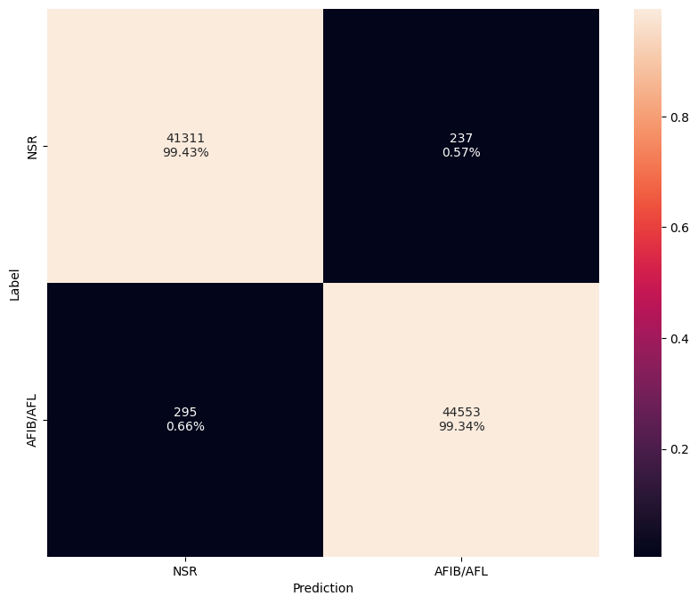
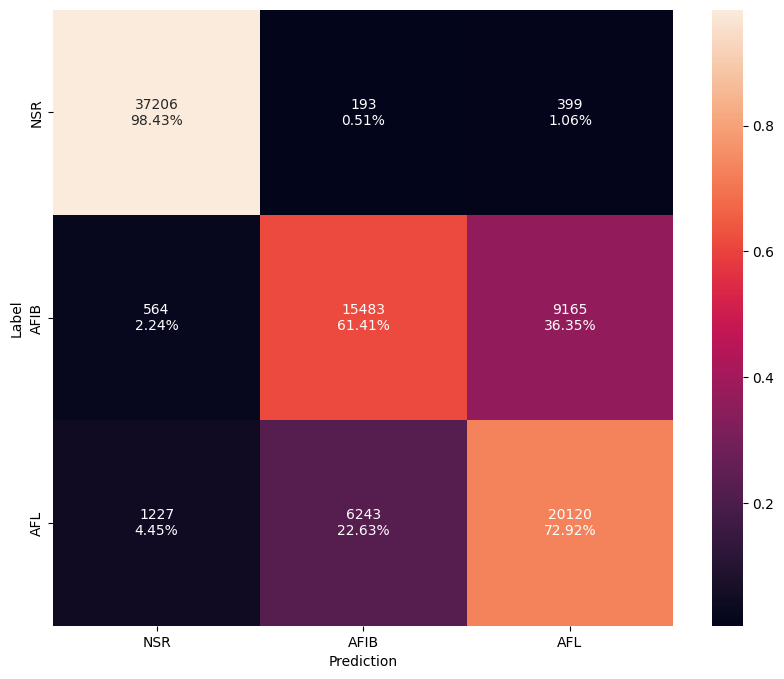

# Pre-Trained Arrhythmia Models

## Model Results

The results of the pre-trained arrhythmia models when tested on 1,000 patients (not used during training) is summarized below.

--8<-- "assets/arrhythmia-model-zoo-table.md"

---

## Datasets

We leverage the following datasets for training the arrhythmia models:

- **[Icentia11k](../datasets/icentia11k.md)**

---

## Model Architectures

The included arrhythmia models utilizes a variation of [EfficientNetV2](../models/efficientnet.md) that is adapted for 1-D time series data. The model is a 1-D CNN built using MBConv style blocks that incorporate expansion, inverted residuals, and squeeze and excitation layers. Furthermore, longer filter and stride lengths are utilized in the initial layers to capture more temporal dependencies.

---

##  Preprocessing

The models are trained directly on single channel ECG data. No feature extraction is performed other than applying a bandpass filter to remove noise followed by resampling to target sampling rate. The signal is then normalized by subtracting the mean and dividing by the standard deviation. We also add a small epsilon value to the standard deviation to avoid division by zero.

---

##  Training Procedure 

For training the models, we utilize the following setup:

- **[Focal loss function](https://arxiv.org/pdf/1708.02002.pdf)**
- **[Adam optimizer](https://arxiv.org/pdf/1412.6980.pdf)**
- **[Cosine decay learning rate scheduler w/ restarts](https://arxiv.org/pdf/1608.03983.pdf)**
- **Early stopping**

---

##  Evaluation Metrics 

For each dataset, 10% of the data is held out for testing. From the remaining, 20% of the data is randomly selected for validation. There is no mixing of subjects between the training, validation, and test sets. Furthermore, the test set is held fixed while training and validation are randomly split during training. We evaluate the models performance using a variety of metrics including loss, accuracy, and F1 score.

---

## Class Mapping

Below outlines the class label mappings used to train arrhythmia models.

=== "2-Class"

    Classify both AFIB and AFL as a single class.

    | Base Class    | Target Class | Label     |
    | ------------- | ------------ | --------- |
    | 0-Normal      | 0            | NSR       |
    | 1-AFIB, 2-AFL | 1            | AFIB|AFL  |

=== "3-Class"

    Distinguish between AFIB and AFL.

    | Base Class    | Target Class | Label     |
    | ------------- | ------------ | --------- |
    | 0-Normal      | 0            | NSR       |
    | 1-AFIB        | 1            | AFIB      |
    | 2-AFL         | 2            | AFL       |

---

## Confusion Matrix

=== "2-Class"

    The confusion matrix for the 75% confidence model is depicted below.

    { width="480" }

=== "3-Class"

    The confusion matrix for the 75% confidence model is depicted below.

    { width="480" }

## EVB Performance

The following table provides the latest hardware performance results when running on Apollo4 Plus EVB.

--8<-- "assets/arrhythmia-model-hw-table.md"

---

<!-- ## Comparison -->

## Ablation Studies

### Confidence Level

=== "2-Class"

    | Metric   | Baseline | 75% Confidence |
    | -------- | -------- | -------------- |
    | Accuracy | 96.5%    | 99.1%          |
    | F1 Score | 96.4%    | 99.0%          |
    | Drop     |  0.0%    | 12.0%          |

=== "3-Class"

    | Metric   | Baseline | 50% Confidence |
    | -------- | -------- | -------------- |
    | Accuracy | 77.6%    | 80.4%          |
    | F1 Score | 77.3%    | 80.1%          |
    | Drop     |  0.0%    | 9.0%           |

!!! Note "Note"

    The baseline model is simply selecting the argmax of model outputs (e.g. `AFIB/AFL`). A confidence level is used such that a label of inconclusive is assigned when the softmax output is below this threshold.
