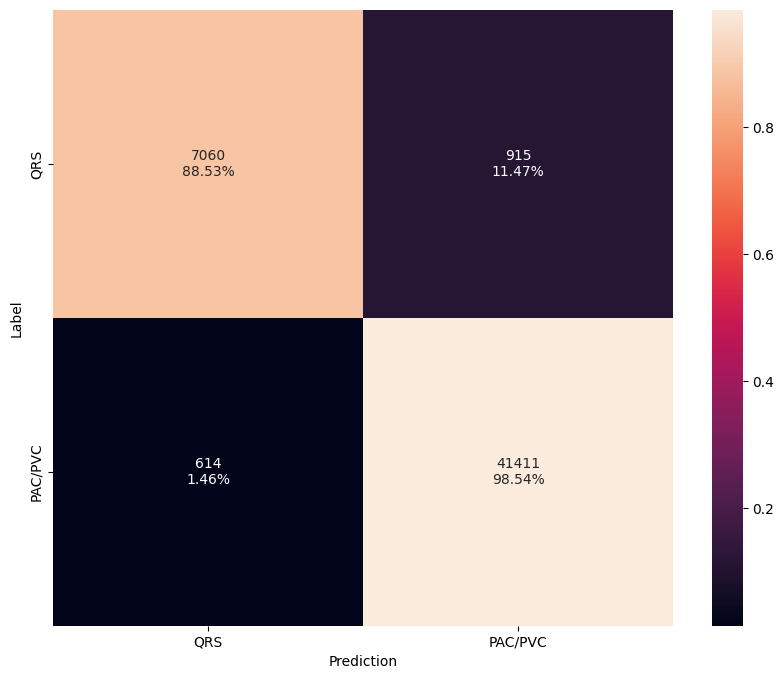
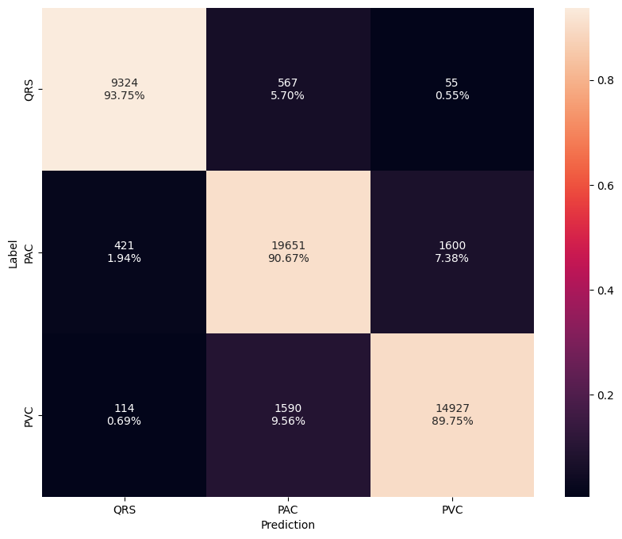

# Pre-Trained Beat Models

##  Model Results 

The following results are obtained from the pre-trained beat models when testing on 1,000 patients (not used during training).

--8<-- "assets/beat-model-hw-table.md"

---

##  Datasets 

We leverage the following datasets for training the beat models:

- **[Icentia11k](../datasets/icentia11k.md)**

---

##  Model Architectures 

The beat model utilizes a 1-D CNN built using MBConv style blocks that incorporate expansion, inverted residuals, and squeeze and excitation layers. Furthermore, longer filter and stride lengths are utilized in the initial layers to capture more temporal dependencies.

---

##  Preprocessing

The models are trained directly on single channel ECG data. No feature extraction is performed other than applying a band-pass filter to remove noise followed by down-sampling. The signal is then normalized by subtracting the mean and dividing by the standard deviation. We also add a small epsilon value to the standard deviation to avoid division by zero.

---

##  Training Procedure 

For training the models, we utilize the following setup:

- **[Focal loss function](https://arxiv.org/pdf/1708.02002.pdf)**
- **[Adam optimizer](https://arxiv.org/pdf/1412.6980.pdf)**
- **[Cosine decay learning rate scheduler w/ restarts](https://arxiv.org/pdf/1608.03983.pdf)**
- **Early stopping**

---

##  Evaluation Metrics 

For each dataset, 10% of the data is held out for testing. From the remaining, 20% of the data is randomly selected for validation. There is no mixing of subjects between the training, validation, and test sets. Furthermore, the test set is held fixed while training and validation are randomly split during training. We evaluate the models performance using a variety of metrics including loss, accuracy, F1 score, average precision (AP).

---

## Class Mapping

Below outlines the class label mappings used to train segmentation models.

=== "2-Stage"

    Classify PAC and PVC as a single class.

    | Base Class    | Target Class | Label     |
    | ------------- | ------------ | --------- |
    | 0-NSR         | 0            | NSR       |
    | 1-PAC, 2-PVC  | 1            | PAC|PVC   |

=== "3-Stage"

    | Base Class    | Target Class | Label     |
    | ------------- | ------------ | --------- |
    | 0-NSR         | 0            | NSR       |
    | 1-PAC         | 1            | PAC       |
    | 2-PVC         | 2            | PVC       |

---

## Confusion Matrix

=== "2-Class"

    The confusion matrix for the 2-class beat model is depicted below.

    { width="480" }

=== "3-Class"

    The confusion matrix for the 3-class model is depicted below.

    { width="480" }

---

## EVB Performance

The following table provides the latest hardware performance results when running on Apollo4 Plus EVB.

--8<-- "assets/beat-model-hw-table.md"

---

## Ablation Studies

### Temporal vs Spatial Channels

The results of three beat models when testing on 1,000 patients (not used during training) are summarized below. The 800x1 model serves as the baseline and classifies individual beats (1 channel) with a fixed time window of 800 ms (160 samples). The 2400x1 model increases the time window to 2,400 ms (480 samples) in order to include surrounding data as context. Increasing the time window increases the accuracy by over `10%` but also causes computation to increase by `3.5x`. The third and best model uses a time window of 800 ms to capture individual beats but includes two additional channels. Using the local average RR interval, the previous and subsequent `beats` are included as side channels. Unlike normal beats, premature and ectopic beats won't be aligned to neighboring beats and serves as useful context. This provides similar temporal resolution as 800x1 but reduces computation by `3.3x` while further improving accuracy by `1.7%`.

| Model      | 800x1  | 2400x1 | 800x3  |
| ---------- | ------ | ------ | ------ |
| Parameters | 73K    | 73K    | 73K    |
| FLOPS      | 2.1M   | 7.6M   | 2.2M   |
| Accuracy   | 78.2%  | 88.6%  | 90.3%  |
| F1 Score   | 77.5%  | 87.2%  | 90.1%  |
