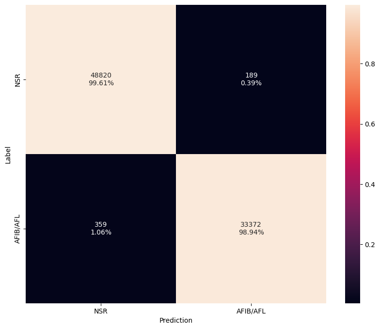
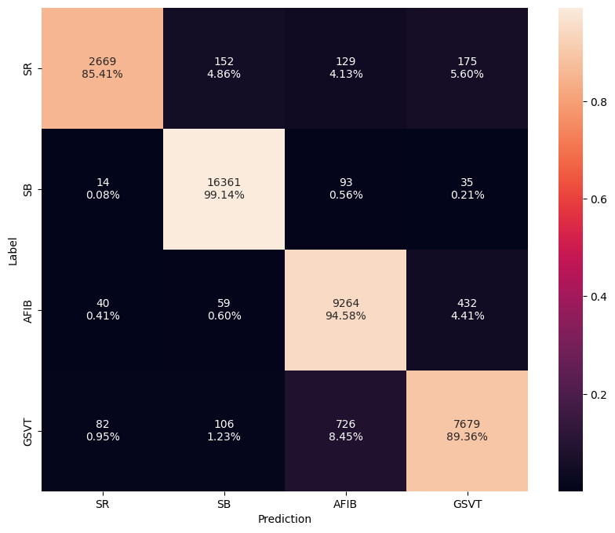

# Pre-Trained Rhythm Models

## Overview

The following table summarizes the high-level results of the rhythm models. The `config` provides the complete configuration JSON file used to train the models. Below we also provide details on the datasets, model architectures, preprocessing, and training procedures used to train the models.

--8<-- "assets/rhythm-model-zoo-table.md"

---

## Datasets

The following datasets were used to train the rhythm models.

=== "2-Class"

    - **[Icentia11k](../datasets/icentia11k.md)**
    - **[PTB-XL](../datasets/ptbxl.md)**
    - **[LSAD](../datasets/lsad.md)**

=== "4-Class"

    - **[Icentia11k](../datasets/icentia11k.md)**
    - **[PTB-XL](../datasets/ptbxl.md)**

---

## Model Architectures

All models utilizes a variation of [EfficientNetV2](../models/efficientnet.md) that is adapted for 1-D time series data. The model is a 1-D CNN built using MBConv style blocks that incorporate expansion, inverted residuals, and squeeze and excitation layers. Furthermore, longer filter and stride lengths are utilized in the initial layers to capture more temporal dependencies.

---

##  Preprocessing

All models are trained on single channel ECG data. No feature extraction is performed other than applying a bandpass filter to remove noise followed by resampling to target sampling rate. The signal is then normalized by subtracting the mean and dividing by the standard deviation. We also add a small epsilon value to the standard deviation to avoid division by zero.

---

##  Training Procedure 

All models are trained using the following setup:

- **[Focal loss function](https://arxiv.org/pdf/1708.02002.pdf)**
- **[Adam optimizer](https://arxiv.org/pdf/1412.6980.pdf)**
- **[Cosine decay learning rate scheduler w/ restarts](https://arxiv.org/pdf/1608.03983.pdf)**
- **Early stopping**

---

## Class Mapping

Below outlines the class label mappings for the arrhtyhmia models.

=== "2-Class"

    Classify both AFIB and AFL as a single class

    | Base Class    | Target Class | Label     |
    | ------------- | ------------ | --------- |
    | 0-Normal      | 0            | NSR       |
    | 7-AFIB, 8-AFL | 1            | AFIB      |

=== "4-Class"

    Identify rhythm into one of four categories: SR, SBRAD, AFIB, GSVT.

    | Base Class     | Target Class | Label                     |
    | -------------- | ------------ | ------------------------- |
    | 0-SR           | 0            | Sinus Rhythm (SR)         |
    | 1-SBRAD        | 1            | Sinus Bradycardia (SBRAD) |
    | 7-AFIB, 8-AFL  | 2            | AFIB/AFL (AFIB) |
    | 2-STACH, 5-SVT | 3            | General supraventricular tachycardia (GSVT) |

---

## Confusion Matrix

=== "2-Class"

    The confusion matrix for the 75% confidence model is depicted below.

    { width="480" }

=== "4-Class"

    The confusion matrix for the 75% confidence model is depicted below.

    { width="480" }

## EVB Performance

The following table provides the latest hardware performance results when running on Apollo4 Plus EVB.

--8<-- "assets/rhythm-model-hw-table.md"

---

<!-- ## Comparison -->

## Ablation Studies

### Confidence Level

=== "2-Class"

    | Metric   | Baseline | 75% Confidence |
    | -------- | -------- | -------------- |
    | Accuracy | 96.5%    | 99.1%          |
    | F1 Score | 96.4%    | 99.0%          |
    | Drop     |  0.0%    | 12.0%          |

!!! Note "Note"

    The baseline model is simply selecting the argmax of model outputs (e.g. `AFIB/AFL`). A confidence level is used such that a label of inconclusive is assigned when the softmax output is below this threshold.
