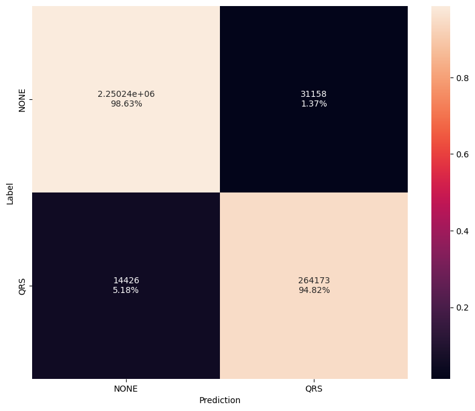
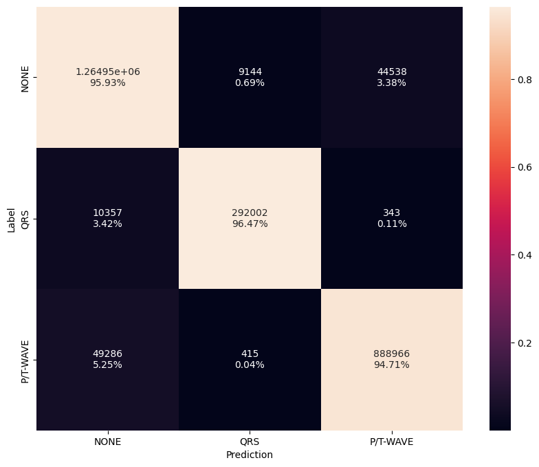
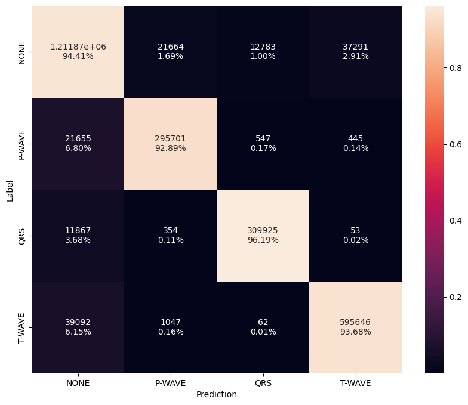

# Pre-Trained Segmentation Models

## Overview

The following table summarizes the high-level results of the segmentation models. The `config` provides the complete configuration JSON file used to train the models. Below we also provide details on the datasets, model architectures, preprocessing, and training procedures used to train the models.

--8<-- "assets/segmentation-model-zoo-table.md"

---

## Datasets

The following datasets were used to train the segmentation models.

=== "2-Class"

    - **[Icentia11k](../datasets/icentia11k.md)**
    - **[PTB-XL](../datasets/ptbxl.md)**

=== "3-Class"

    - **[Lobachevsky University Electrocardiography dataset (LUDB)](../datasets/ludb.md)**
    - **[QT dataset (QTDB)](../datasets/qtdb.md)**
    - **[Synthetic via PhysioKit](../datasets/synthetic.md)**

=== "4-Class"

    - **[Lobachevsky University Electrocardiography dataset (LUDB)](../datasets/ludb.md)**
    - **[QT dataset (QTDB)](../datasets/qtdb.md)**
    - **[Synthetic via PhysioKit](../datasets/synthetic.md)**

---

## Model Architectures

The following model architectures were used to train the segmentation models.

=== "2-Class"

    The model is based on a [TCN architecture](../models/tcn.md).

=== "3-Class"

    The model is based on a  [U-Net architecture](../models/unet.md)

=== "4-Class"

    The model is based on a  [U-Net architecture](../models/unet.md)

---

##  Preprocessing

All models are trained on single channel ECG data. No feature extraction is performed. The data is preprocessed by applying a band-pass filter to remove noise followed by down-sampling. The filtered ECG signals are normalized by subtracting the mean and dividing by the standard deviation. We also add a small epsilon value to the standard deviation to avoid division by zero.

---

##  Training Procedure 

All models are trained using the following setup:

- **[Focal loss function](https://arxiv.org/pdf/1708.02002.pdf)**
- **[Adam optimizer](https://arxiv.org/pdf/1412.6980.pdf)**
- **[Cosine decay learning rate scheduler w/ restarts](https://arxiv.org/pdf/1608.03983.pdf)**
- **Early stopping**

---

<!-- ##  Evaluation Metrics 

For each dataset, 10% of the data is held out for testing. From the remaining, 20% of the data is randomly selected for validation. There is no mixing of subjects between the training, validation, and test sets. Furthermore, the test set is held fixed while training and validation are randomly split during training. We evaluate the models performance using a variety of metrics including loss, accuracy, F1 score, average precision (AP). -->

## Class Mapping

Below outlines the class label mappings for the segmentation models.

=== "2-Class"

    Detect only QRS complexes

    | Base Class    | Target Class | Label     |
    | ------------- | ------------ | --------- |
    | 0-NONE        | 0            | NONE      |
    | 2-QRS         | 1            | QRS       |

=== "3-Class"

    Bucket the P-wave and T-wave into a single class.

    | Base Class       | Target Class | Label        |
    | ---------------- | ------------ | ------------ |
    | 0-NONE           | 0            | NONE         |
    | 2-QRS            | 1            | QRS          |
    | 1-PWAVE, 3-TWAVE | 2            | PWAVE, TWAVE |

=== "4-Class"

    Identify each of the P-wave, QRS complex, and T-wave.

    | Base Class       | Target Class | Label        |
    | ---------------- | ------------ | ------------ |
    | 0-NONE           | 0            | NONE         |
    | 1-PWAVE          | 1            | PWAVE        |
    | 2-QRS            | 2            | QRS          |
    | 3-TWAVE          | 3            | TWAVE        |

## Confusion Matrix

=== "2-Class"

    { width="480" }

=== "3-Class"

    { width="480" }

=== "4-Class"

    { width="480" }

---

## EVB Performance

The following table provides the latest hardware performance results when running on Apollo4 Plus EVB.

--8<-- "assets/segmentation-model-hw-table.md"
